<p align="center">
    
</p>

<br>

<div align="center">


<br>
<br>


<br>


<br>
<br>


<br>


<br>

<br>
<br>


<br>
<br>


<br>


<br>


<br>


<br>
<br>

[](https://opensource.org/licenses/MIT)
</div>

# _MAVIS_
**MA**_th_ **V**_isual_ **I**_ntelligent_ **S**_ystem (Strongest calculator in the world)._

_Think you're better at math than an AI? Prove it! Show that there are infinitely many prime numbers exactly 2 apart. No proof? No answer? Well, maybe you do need AI after all! So, what are you waiting for? Ask [MAVIS - install](#installation)!_
<details>
  <summary>Deutsch</summary>
    Denkst du, du bist besser in Mathe als eine KI? Beweise es! Zeig, dass es unendlich viele Primzahlen gibt, die genau 2 auseinander liegen. Kein Beweis? Keine Antwort? Tja – vielleicht geht’s doch nicht ohne KI! Worauf wartest du? Frag MAVIS!
</details>

<div style="display: flex; justify-content: center; align-items: center; gap: 20px; flex-wrap: wrap;">
  
</div>

<br>

> ⚠️ **Still in progress** ;-)

> ⚠️ Important warning: Beware of fake accounts!<br>
There is evidence that fake accounts may attempt to misrepresent this project. Please do not share personal information with anyone you do not know and only rely on content coming directly from this repository. Immediately report large activities or accounts to GitHub or the project team.

<details>
  <summary>Deutsch</summary>

> ⚠️ Wichtiger Hinweis: Vorsicht vor Fake-Accounts!<br>
> Es gibt Hinweise darauf, dass Fake-Accounts versuchen könnten, dieses Projekt falsch darzustellen. Bitte geben Sie keine persönlichen Daten an Unbekannte weiter und verlassen Sie sich nur auf Inhalte, die direkt aus diesem Repository stammen. Melden Sie umfangreiche Aktivitäten oder Accounts umgehend an GitHub oder das Projektteam.

</details>

> **English**: MAVIS is an AI-driven application that allows you to analyze visual data such as images (formats: PNG, JPG, JPEG and GIF) and generate interactive answers based on them. With MAVIS you can perform complex mathematical calculations, solve programming tasks and create professional graphics.
> 
> To achieve optimal results, please note the following:
> 
> - Always display formulas in LaTeX to ensure precise and attractive formatting.
> 
> 
> - Ask MAVIS to always write code in Python, as this is the only language supported by the user interface.
> 
> 
> - Ask MAVIS to create graphics using Matplotlib, as the user interface only supports HTML, LaTeX and Python (version 3.13 with the frameworks Matplotlib, Plotly, Seaborn, Altair, NumPy, Math, SymPy, Pandas, AstroPy, QuantLib, OpenMDAO, pybullet, MONAI (if needed soon: PyTorch, TensorFlow, Keras, Scikit-Learn and Hugging Face Transformers (maybe JAX)).
> 
> Use the powerful features of MAVIS to make your projects more efficient and professional.

<details>
  <summary>Deutsch</summary>

> **Deutsch**: MAVIS ist eine KI-gesteuerte Anwendung, die Ihnen ermöglicht, visuelle Daten wie Bilder (Formate: PNG, JPG, JPEG und GIF) zu analysieren und darauf basierend interaktive Antworten zu generieren. Mit MAVIS können Sie komplexe mathematische Berechnungen durchführen, programmiertechnische Aufgaben lösen und professionelle Grafiken erstellen.
> 
> Um optimale Ergebnisse zu erzielen, beachten Sie folgende Hinweise:
> 
> - Lassen Sie Formeln stets in LaTeX darstellen, um eine präzise und ansprechende Formatierung zu gewährleisten.
> 
> 
> - Fordern Sie MAVIS dazu auf, Code immer in Python zu schreiben, da nur dieser von der Benutzeroberfläche unterstützt wird.
> 
> 
> - Bitten Sie MAVIS, Grafiken mithilfe von Matplotlib zu erstellen, da die Benutzeroberfläche ausschließlich HTML, LaTeX und Python (Version 3.13 mit den Frameworks Matplotlib, Plotly, Seaborn, Altair,NumPy, Math, SymPy und Pandas (bei Bedarf soon: PyTorch, TensorFlow, Keras, Scikit-Learn und Hugging Face Transformers (vielleicht noch JAX)) unterstützt.
> 
> Nutzen Sie die leistungsstarken Funktionen von MAVIS, um Ihre Projekte effizienter und professioneller zu gestalten.

</details>

<br>

<div style="display: flex; justify-content: center; align-items: center; gap: 20px; flex-wrap: wrap;">
  
</div>

## Table of contents
- [News](#news)
- [Updates](#updates)
- [Versions](#versions)
- [Benchmark](#benchmark)
- [Installation](#installation)
- [Usage](#using)
- [Xc++](#Xcpp)
- [Demo](#demo)
- [Learn_MAVIS](#learn-mavis)
- [Transformer](#transformer)
- [License](#lizenz)

---

## News

- **[09.11.2024]** Start ;-)
- **[10.11.2024]** Available with Llama3.2 + [Demo](#demo-text) with Xc++ 2
- **[13.11.2024]** [Demo](#demo) UI
- **[21.11.2024]** MAVIS with Python (Version 3.11/**12**/13 with the frameworks Matplotlib, NumPy, Math, SymPy and Pandas) [Demo](#demo)
- **[28.11.2024]** Available with **Plotly** but still bugs that need to be resolved
- **[30.11.2024]** MAVIS can write **PyTorch, TensorFlow, Keras, Scikit-Learn and Hugging Face Transformers (maybe JAX) code** and run it side-by-side without the need for an IDE. But it is only intended for experimentation.
- **[01.12.2024]** MAVIS EAP release
- **[03.12.2024]** Available with **Altair**
- **[24.12.2024]** MAVIS 1.3 EAP release: new Plotly functions [Demo](#demo) + Stronger adaptability through Transformer (Huggingface) + Bigger Input Box
- **[01.02.2025]** MAVIS 1.5 EAP release: new functions
- **[01.03.2025]** MAVIS 1.5 release!!!
- **[01.04.2025]** MAVIS 1.6 EAP release!!!

## Updates

<details>
  <summary>Old MAVIS Versions</summary>

### MAVIS 1.1 EAP release (with Llama 3.2) [old]

<p align="center">
    
</p>

### Demo

<details>
  <summary>more</summary>

<div>
    
</div>

And more...

</details>

> 01.12.2024

### MAVIS 1.2 release [no more updates in the areas of graphics, frameworks and security]

<div style="display: flex; justify-content: center; align-items: center; gap: 20px; flex-wrap: wrap;">
  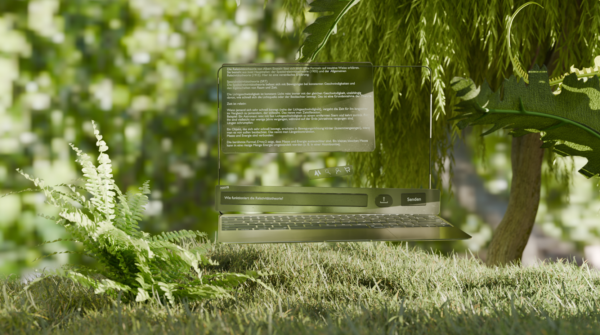
</div>

### Demo

<details>
  <summary>more</summary>

<div>
    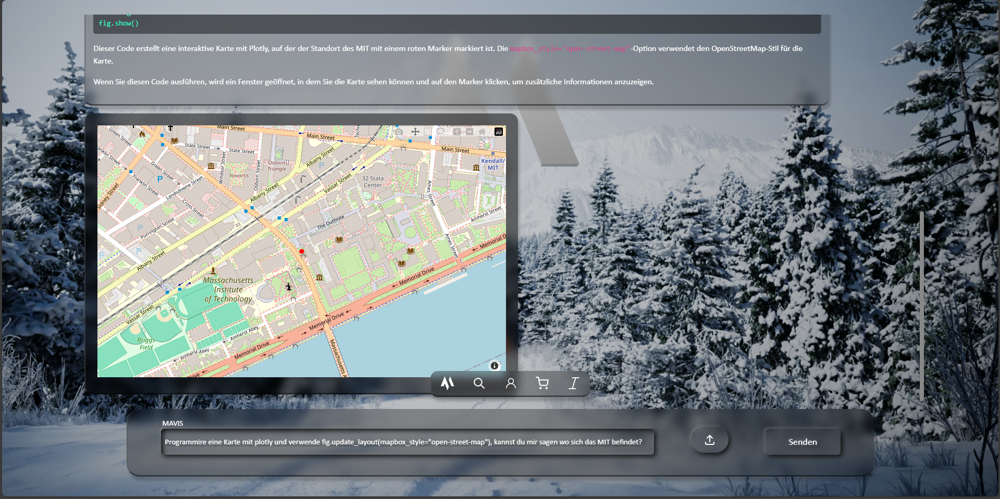
</div>

And more...

</details>

> 12.12.2024 

### MAVIS 1.3 EAP release [experimental]

<p align="center">
  
</p>

### Demo

<details>
  <summary>more</summary>

<div>
    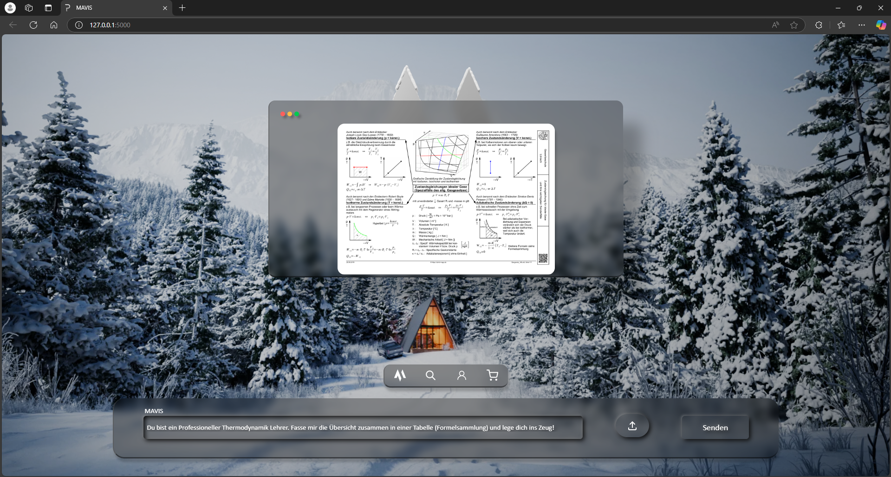
    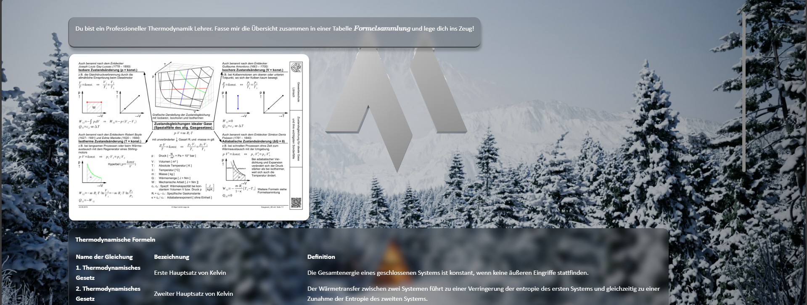
    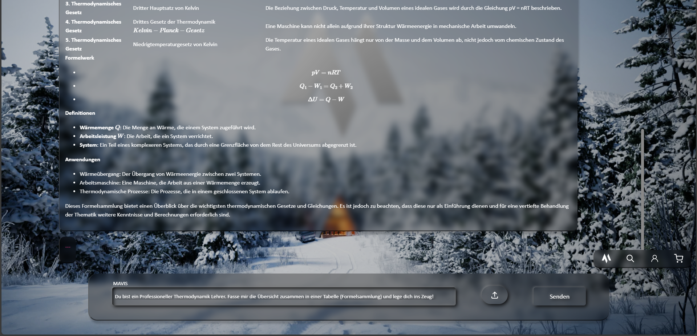
</div>

And more...

</details>

> 24.12.2024

### MAVIS 1.4 EAP release 

> This update (MAVIS 1.4 EAP) is skipped and MAVIS 1.5 EAP is out

<details>
  <summary>MAVIS 1.4 EAP</summary>

<div style="display: flex; justify-content: center; align-items: center; gap: 20px; flex-wrap: wrap;">
  
</div>

### Demo

soon...

And more...

> 01.01.2025

</details>

</details>

### MAVIS 1.5 release [new]

> 01.03.2025 - ultimate stabel!!!

<div style="display: flex; justify-content: center; align-items: center; gap: 20px; flex-wrap: wrap;">
  
</div>

### Demo

<details>
  <summary>more</summary>

<div>
    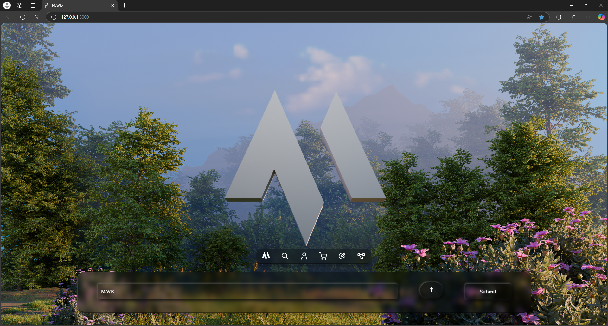
</div>

<div>
    
</div>

<div>
    
</div>

<div>
    
</div>

<div>
    
</div>

<div>
    
</div>

<div>
    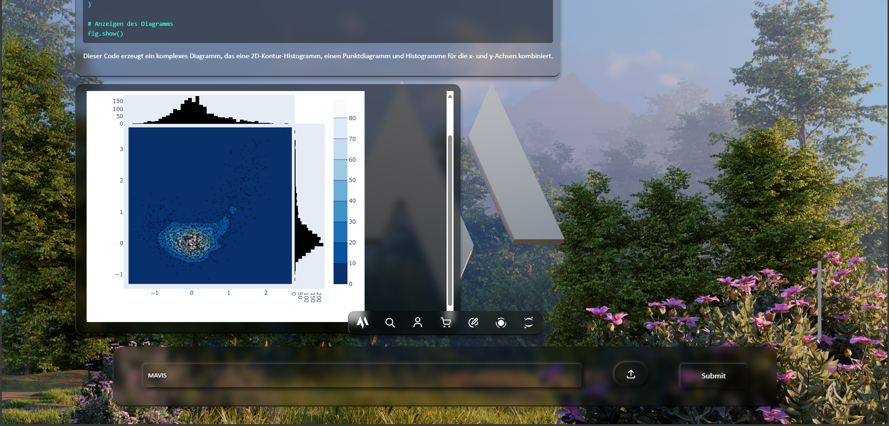
</div>

<div>
    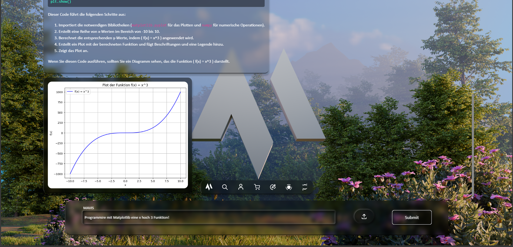
</div>

<div>
    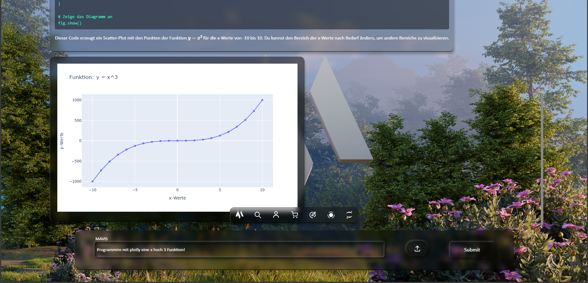
</div>

<div>
    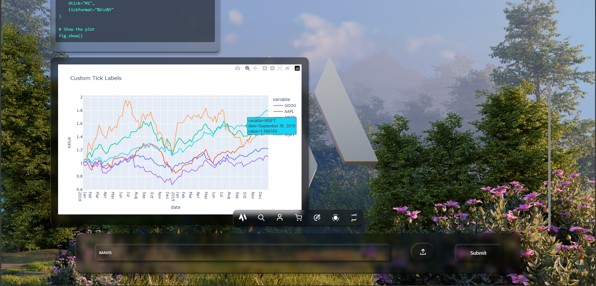
</div>

And more...

</details>

> 28.01.2025

<details>
  <summary>Frameworks that MAVIS 1.5 knows</summary>

- **[LaTeX Documentation](https://www.latex-project.org/)** – Comprehensive information about LaTeX and its use for mathematical formula notation.  

- **[Matplotlib Documentation](https://matplotlib.org/)** – Official documentation for **Matplotlib**, a comprehensive library for creating 2D plots and visualizations in Python.  

- **[Plotly Documentation](https://plotly.com/python/)** – Extensive guides and examples for interactive visualization with **Plotly**.  

- **[Seaborn Documentation](https://seaborn.pydata.org/)** – Documentation for **Seaborn**, a statistical data visualization library built on Matplotlib.  

- **[NumPy Documentation](https://numpy.org/doc/stable/)** – Official site for **NumPy**, providing a powerful library for numerical computations and working with arrays.  

- **[SymPy Documentation](https://docs.sympy.org/latest/index.html)** – Official documentation for **SymPy**, a Python library for symbolic mathematics.  

- **[Pandas Documentation](https://pandas.pydata.org/pandas-docs/stable/)** – Comprehensive documentation for **Pandas**, a library for data manipulation and analysis.  

- **[SciPy Documentation](https://docs.scipy.org/doc/scipy/)** – Documentation for **SciPy**, a library for scientific and technical computing.  

- **[PyTorch Documentation](https://pytorch.org/docs/stable/)** – Official documentation for **PyTorch**, a popular library for machine learning and deep learning.  

- **[TensorFlow Documentation](https://www.tensorflow.org/api_docs)** – The official documentation for **TensorFlow**, a comprehensive library for implementing deep learning models.  

- **[Scikit-learn Documentation](https://scikit-learn.org/stable/)** – Official documentation for **Scikit-learn**, a library for building machine learning models.  

- **[Transformers Documentation](https://huggingface.co/docs/transformers/)** – Documentation for **Transformers**, a library by Hugging Face for Natural Language Processing (NLP).  

- **[GeoPandas Documentation](https://geopandas.org/en/stable/)** – Documentation for **GeoPandas**, a library for working with geospatial data.  

- **[Astropy Documentation](https://docs.astropy.org/en/stable/)** – Official documentation for **Astropy**, a library for astronomical computations and data analysis.  

- **[OpenMDAO Documentation](https://openmdao.org/)** – Documentation for **OpenMDAO**, a framework library for multidisciplinary optimization and simulation.  

- **[PyBullet Documentation](https://pybullet.org/)** – Extensive guide and documentation for using **PyBullet**, a physics simulation library.  

- **[Monai Documentation](https://monai.io/)** – Documentation for **Monai**, a deep learning library for healthcare applications.  

- **[FEniCS Documentation](https://fenicsproject.org/)** – Official documentation for **FEniCS**, a framework for solving partial differential equations.  

- **[PyDy Documentation](http://www.pydy.org/)** – Documentation for **PyDy**, a framework for modeling and simulating multi-dimensional dynamic systems.  

- **[PyCalculix Documentation](https://github.com/stevencook/pycalculix)** – Extensive guidelines for using **PyCalculix**, a Python interface for Calculix for finite element analysis.  

- **[SolidPython Documentation](https://solidpython3.github.io/solidpython/)** – Official documentation for **SolidPython**, a framework for generating 3D model data for CAD.  

- **[Pyomo Documentation](http://www.pyomo.org/)** – The official documentation for **Pyomo**, a framework for mathematical optimization.  

- **[Gekko Documentation](https://gekko.readthedocs.io/en/latest/)** – Documentation for **Gekko**, a library for solving optimization and control problems.  

- **[CasADi Documentation](https://web.casadi.org/docs/)** – Extensive guidelines for using **CasADi**, a library for optimization and simulation.  

- **[Control Documentation](https://python-control.readthedocs.io/en/latest/)** – Documentation for **Control**, a Python library for analyzing and synthesizing control systems.  

- **[Rospy Documentation](https://docs.ros.org/en/noetic/api/rospy/html/)** – The official documentation for **Rospy**, a Python client for the Robot Operating System (ROS).  

- **[H2O Documentation](http://docs.h2o.ai/)** – Documentation for **H2O.ai**, a platform for machine learning and AI.  

- **[Pint Documentation](https://pint.readthedocs.io/en/stable/)** – The official documentation for **Pint**, a library for handling physical units.  

- **[CoolProp Documentation](https://coolprop.readthedocs.io/en/latest/)** – Comprehensive documentation for **CoolProp**, a library for thermodynamics and fluid mechanics.  

- **[PyThermo Documentation](https://pythermo.readthedocs.io/en/latest/)** – Guidelines for using **PyThermo**, a Python library for thermodynamic calculations.  

- **[BioPython Documentation](https://biopython.org/)** – Official documentation for **BioPython**, a library for bioinformatics computations.  

- **[OpenCV Documentation](https://docs.opencv.org/master/)** – The official documentation for **OpenCV**, a library for computer vision and image processing.  

- **[SimpleITK Documentation](https://simpleitk.readthedocs.io/en/master/)** – Comprehensive documentation for **SimpleITK**, a library for medical image processing.  

- **[Nilearn Documentation](https://nilearn.github.io/)** – The official documentation for **Nilearn**, a library for analyzing neuroimaging data.  

- **[DeepChem Documentation](https://deepchem.io/)** – Documentation for **DeepChem**, a library for machine learning in chemistry and materials science.  

- **[PyMedTermino Documentation](https://pymedtermino.readthedocs.io/en/latest/)** – Documentation for **PyMedTermino**, a Python library for working with medical terminology.  

- **[Lifelines Documentation](https://lifelines.readthedocs.io/en/latest/)** – Extensive guide on using **Lifelines**, a library for survival analysis.  

- **[RDKit Documentation](https://www.rdkit.org/docs/)** – Documentation for **RDKit**, a library for cheminformatics.  

- **[ASE Documentation](https://wiki.fysik.dtu.dk/ase/)** – Official documentation for **ASE**, a framework for performing atomic simulations.  

- **[ChemPy Documentation](https://chemphys.github.io/chemPy/)** – Documentation for **ChemPy**, a library for chemical computations.  

- **[Shapely Documentation](https://shapely.readthedocs.io/en/stable/)** – The documentation for **Shapely**, a library for geometric analysis.  

- **[Fiona Documentation](https://fiona.readthedocs.io/en/stable/)** – Official documentation for **Fiona**, a library for processing geospatial data.  

- **[Cartopy Documentation](https://scitools.org.uk/cartopy/docs/latest/)** – Documentation for **Cartopy**, a library for creating geospatial visualizations.  

- **[Statsmodels Documentation](https://www.statsmodels.org/stable/)** – Comprehensive documentation for **Statsmodels**, a library for statistical modeling.  

- **[YFinance Documentation](https://pypi.org/project/yfinance/)** – The official documentation for **YFinance**, a library for accessing financial data from Yahoo Finance.  

- **[QuantLib Documentation](https://www.quantlib.org/documentation.shtml)** – The official documentation for **QuantLib**, a comprehensive library for quantitative financial analysis and the valuation of financial instruments like options, bonds, and derivatives.  

- **[PySpice Documentation](https://pyspice.org/)** – The official documentation for **PySpice**, a library for simulating electronic circuits and circuit analysis with Python.  

- **[NetworkX Documentation](https://networkx.github.io/)** – The official documentation for **NetworkX**, a Python library for analyzing and creating networks and graphs.  

- **[Schematics Documentation](https://schematics.readthedocs.io/en/latest/)** – The official documentation for **Schematics**, a Python library for defining and validating data structures and models with type checking.

- **[Schemdraw Documentation](https://schemdraw.readthedocs.io/en/latest/)** – The official documentation for **Schemdraw**, a Python library for creating electronic circuit diagrams with standardized symbols and simplified representations.
  
- **[IPyWidgets Documentation](https://ipywidgets.readthedocs.io/en/stable/)** – The official documentation for **IPyWidgets**, a Python library for creating interactive widgets in Jupyter Notebooks, enabling users to interact with data and visualizations.
  
- **[PyBullet Documentation](https://pybullet.org/)** – The official documentation for **PyBullet**, a physics-based simulation library for 3D environments and robot simulations, accounting for collisions, forces, and movements.
  
- **[VTK Documentation](https://vtk.org/documentation/)** – The official documentation for **VTK**, an open-source library for 3D data visualization and processing, used in fields such as scientific visualization and medical image processing.

---

</details>

### MAVIS 1.6 EAP release [soon]

<div style="display: flex; justify-content: center; align-items: center; gap: 20px; flex-wrap: wrap;">
  
</div>

<br>

> +01.04.2025

<details>
  <summary>More MAVIS versions</summary>

### MAVIS 1.7 EAP release

<div style="display: flex; justify-content: center; align-items: center; gap: 20px; flex-wrap: wrap;">
  
</div>

<br>

> 01.05.2025

### MAVIS 1.8 EAP release

<div style="display: flex; justify-content: center; align-items: center; gap: 20px; flex-wrap: wrap;">
  
</div>

<br>

> 01.06.2025

### MAVIS 1.9 EAP release

<p align="center">
  
</p>

<br>

> 01.07.2025

### MAVIS big release on Windows / Linux / MAC OS (no EAP)

<p align="center">
     
</p>

<br>

> 01.08.2025
 
### MAVIS on Apple Vision Pro                     
<p align="center">
     
</p>

<br>

> soon

### MAVIS 2.0                     
<div style="display: flex; justify-content: center; align-items: center; gap: 20px; flex-wrap: wrap;">
  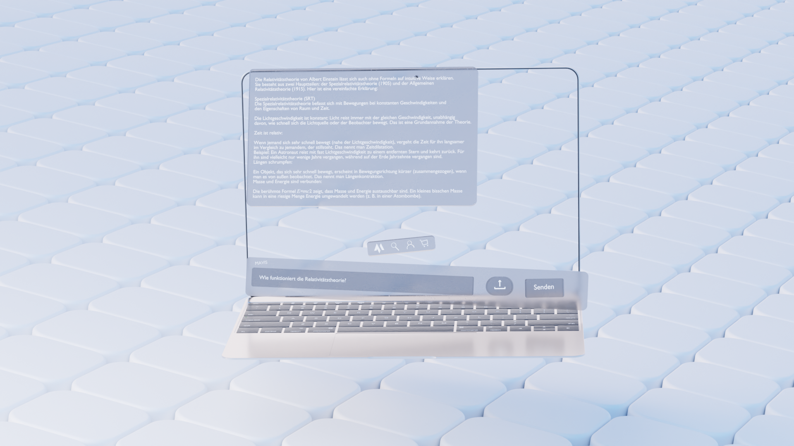
</div>

<br>

> 01.01.2026

### MAVIS 2.1                     
<p align="center">
    
</p>

<br>

> 01.03.2026

### MAVIS 2.2                     
<div style="display: flex; justify-content: center; align-items: center; gap: 20px; flex-wrap: wrap;">
  
</div>

<br>

> 01.05.2026

### MAVIS 2.3                     
<div style="display: flex; justify-content: center; align-items: center; gap: 20px; flex-wrap: wrap;">
  
</div>

<br>

> 01.07.2026

</details>

<br>

## Versions

<div style="display: flex; justify-content: center; align-items: center; gap: 20px; flex-wrap: wrap;">
  
</div>

<br>

> ⚠️**Still in progress**

| **Model**                | **Description**                                           | **Requirements**                               | **Parameters**   |
|--------------------------|-----------------------------------------------------------|------------------------------------------------|------------------|            
| Mavis 1.2 main           | With **Xc++ 2 11B** or Llama3.2 11B +16GB RAM             | +23GB storage (Works with one CPU)             | 22B              |
| Mavis 1.2 math           | With **Xc++ 2 11B** or Llama3.2 11B + Qwen 2.5 14B        | +16GB RAM +23GB storage (Works with one CPU)   | 25B              |
| Mavis 1.2 code           | With **Xc++ 2 11B** or Llama3.2 11B + Qwen 2.5 Coder 14B  | +16GB RAM +23GB storage (Works with one CPU)   | 25B              |
| Mavis 1.2 math pro       | With **Xc++ 2 90B** or Llama3.2 90B + QwQ +64GB RAM       | +53GB storage (Works with one CPU)             | 122B             |
| Mavis 1.2 code pro       | With **Xc++ 2 90B** or Llama3.2 90B + Qwen 2.5 Coder 32B  | +64GB RAM +53GB storage (Works with one CPU)   | 122B             |
| Mavis 1.2 mini           | With **Xc++ 2 11B** or Llama3.2 11B + Qwen 2.5 0.5B       | +16GB RAM +13GB storage (Works with one CPU)   | 11.5B            |
| Mavis 1.2 mini mini      | With **Xc++ 2 11B** or Llama3.2 11B + smollm:135m         | +16GB RAM +33GB storage (Works with one CPU)   | 11.0135B         |
| Mavis 1.2.2 main         | With **Xc++ 2 11B** or Llama3.2 11B + Phi4 +16GB RAM      | +23GB storage (Works with one CPU)             | 25B              |
| Mavis 1.2.2 math         | With **Xc++ 2 11B** or Llama3.2 11B + DeepSeek R1 14B     | +16GB RAM +23GB storage (Works with one CPU)   | 25B              |
| Mavis 1.2.2 math pro     | With **Xc++ 2 11B** or Llama3.2 11B + DeepSeek R 32B      | +32GB RAM +33GB storage (Works with one CPU)   | 43B              |
| Mavis 1.2.2 math ultra   | With **Xc++ 2 90B** or Llama3.2 90B + DeepSeek R1 671B    | +256GB RAM +469GB storage (Works with one CPU) | 761B             |
| Mavis 1.3 main           | With **Xc++ 2 11B** or Qwen2 VL 7B + Llama 3.3            | +64GB RAM +53GB storage (Works with one CPU)   | 77B              |
| Mavis 1.3 math           | With **Xc++ 2 11B** or Qwen2 VL 7B + Qwen 2.5 14B         | +16GB RAM +33GB storage (Works with one CPU)   | 21B              |
| Mavis 1.3 code           | With **Xc++ 2 11B** or Qwen2 VL 7B + Qwen 2.5 Coder 14B   | +16B RAM +33GB storage (Works with one CPU)    | 21B              |
| Mavis 1.3 math pro       | With **Xc++ 2 90** or Qwen2 VL 72B + QwQ 32B              | +64GB RAM +53GB storage (Works with one CPU)   | 104B             |
| Mavis 1.3 math pro       | With **Xc++ 2 90B** or Qwen2 VL 72B + Qwen 2.5 Coder 32B  | +64GB RAM +53GB storage (Works with one CPU)   | 104B             |
| Mavis 1.4 math           | With **Xc++ 2 90B** or QvQ + QwQ 32B                      | +64GB RAM +53GB storage (Works with one CPU)   | 104B             |
| Mavis 1.5 main           | With **Xc++ 2 11B** or Llama3.2 11B + Phi 4 14B           | +16GB RAM +23GB storage (Works with one CPU)   | 25B              |
| Mavis 1.5 math           | With **Xc++ 2 11B** or Llama3.2 11B + DeepSeek R1 14B     | +16GB RAM +23GB storage (Works with one CPU)   | 25B              |
| Mavis 1.5 math pro       | With **Xc++ 2 11B** or Llama3.2 11B + DeepSeek R 32B      | +32GB RAM +33GB storage (Works with one CPU)   | 43B              |
| Mavis 1.5 math ultra     | With **Xc++ 2 90B** or Llama3.2 90B + DeepSeek R1 671B    | +256GB RAM +469GB storage (Works with one CPU) | 761B             |
| Mavis 1.5 math mini      | With **Xc++ 2 11B** or Llama3.2 11B + DeepSeek R1 7B      | +16GB RAM +18GB storage (Works with one CPU)   | 18B              |
| Mavis 1.5 math mini mini | With **Xc++ 2 11B** or Llama3.2 11B + DeepSeek R1 1.5B    | +16GB RAM +14GB storage (Works with one CPU)   | 12.5B            |
| Mavis 1.5 code           | With **Xc++ 2 11B** or Llama3.2 11B + Qwen 2.5 Coder 14B  | +16GB RAM +23GB storage (Works with one CPU)   | 25B              |
| Mavis 1.5 code pro       | With **Xc++ 2 11B** or Llama3.2 11B + Qwen 2.5 Coder 32B  | +32GB RAM +33GB storage (Works with one CPU)   | 43B              |
| Mavis 1.5 code mini      | With **Xc++ 2 11B** or Llama3.2 11B + Qwen 2.5 Coder 7B   | +16GB RAM +18GB storage (Works with one CPU)   | 18B              |
| Mavis 1.5 code mini mini | With **Xc++ 2 11B** or Llama3.2 11B + Qwen 2.5 Coder 1.5B | +16GB RAM +14GB storage (Works with one CPU)   | 12.5B            |

## Benchmark

<div style="display: flex; justify-content: center; align-items: center; gap: 20px; flex-wrap: wrap;">
  
</div>

<br>

> ⚠️**Still in progress**

|               | Xc++ III | DeepSeek<br>R1 | QwQ<br>32B-preview | Open AI<br>o1 | Open AI<br>o1-preview | Open AI<br>o1 mini | GPT-4o   | Claude3.5<br>Sonnet |
|---------------|---------|----------------|--------------------|---------------|-----------------------|--------------------|----------|---------------------|
| GPQA          | ...     | 71.5 | 65.2               | 75.7          | 72.3                  | 60.0               | 53.6     | 49.0                |
| AIME          | ...     | 79.8 | 50.0               | 79.2          | 44.6                  | 56.7               | 59.4     | 53.6                |
| MATH-500      | ...     | 97.3 | 90.6               | 96.4          | 85.5                  | 90.0               | 76.6     | 82.6                |
| LiveCodeBench | ...     | ...  | 50.0               | ...           | 53.6                  | 58.0               | 33.4     | 30.4                |
| Codeforces    | ...     | 96.3 | ...                | 96.6          | 92.4                  | 92.4               | 90.2     | 92.0                |

## Installation

> ⚠️**Still in progress**

### English:

<details>
<summary>Installation</summary>

**MAVIS (aka Xc++ III)** is currently under development and is not fully available in this repository. Cloning the repository will only give you the README file, some images and already released code, including the user interface (UI) compatible with **Qwen 2.5 Code** and **Llama 3.2 Vision**.

**Note:** Although manual installation is not much more complicated, it is significantly more stable and secure, so we recommend preferring this method.

The automatic installation installs Git, Python and Ollama, creates a folder and sets up a virtual Python environment. It also installs the required Python frameworks and AI models - but this step is also done automatically with the manual installation.

<details>
  <summary>Automatic Installation (experimental)</summary>

If you still prefer the automatic installation, please follow the instructions below:

### Installation

<details>
  <summary>Automatic Installation on Windows</summary>

1. **Download the installation file:**<br>
- Download the file [`mavis-installer.bat`](https://github.com/Peharge/MAVIS/blob/main/mavis-installer/mavis-installer.bat) from GitHub.

2. **Run the installation file:**<br>
- Run the downloaded file by double-clicking it.

3. **Accept security warnings:**<br>
- If Windows issues a security warning, accept it and allow execution.

4. **Follow the installation instructions:**<br>
- Follow the on-screen instructions to install MAVIS.
     
### Starting the UI

**Start the UI**<br>
   After installation, you can start MAVIS. There are several start options that vary depending on the version and intended use:<br>
   - All MAVIS versions:
     - `run-mavis-all.bat` (experimental)<br>
   - With a batch file for MAVIS 1.2:
     - `run-mavis-1-2-main.bat` (recommended)
     - `run-mavis-1-2-code.bat` (recommended)
     - `run-mavis-1-2-code-pro.bat` (recommended)
     - `run-mavis-1-2-math.bat` (recommended)
     - `run-mavis-1-2-math-pro.bat` (recommended)
     - `run-mavis-1-2-mini.bat` (recommended)
     - `run-mavis-1-2-mini-mini.bat` (recommended)
     - `run-mavis-1-2-3-main.bat` (recommended)
     - `run-mavis-1-2-3-math.bat` (recommended)
     - `run-mavis-1-2-3-math-pro.bat` (recommended)
     - `run-mavis-1-2-3-math-ultra.bat` (recommended)<br>
   - for MAVIS 1.3 EAP:
     - `run-mavis-1-3-main.bat` (experimental)
     - `run-mavis-1-3-code.bat` (experimental)
     - `run-mavis-1-3-code-pro.bat` (experimental)
     - `run-mavis-1-3-math.bat` (experimental)
     - `run-mavis-1-3-math-pro.bat` (experimental)<br>
   - for MAVIS 1.4 EAP:
     - `run-mavis-1-4-math.bat` (experimental)<br>
   - for MAVIS 1.5 EAP:
     - `run-mavis-1-5-main.bat` (experimental)
     - `run-mavis-1-5-math.bat` (experimental)
     - `run-mavis-1-5-math-pro.bat` (experimental)
     - `run-mavis-1-5-math-ultra.bat` (experimental)
     - `run-mavis-1-5-math-mini.bat` (experimental)
     - `run-mavis-1-5-math-mini-mini.bat` (experimental)
     - `run-mavis-1-5-code.bat` (experimental)
     - `run-mavis-1-5-code-pro.bat` (experimental)
     - `run-mavis-1-5-code-mini.bat` (experimental)
     - `run-mavis-1-5-code-mini-mini.bat` (experimental)

### Have fun with MAVIS 🚀

---

</details>

<details>
  <summary>Automatic Installation on macOS/Linux</summary>

1. **Download the installation file:**<br>
- Download the file [`mavis-installer.sh`](https://github.com/Peharge/MAVIS/blob/main/mavis-installer/mavis-installer.sh) from GitHub.

2. **Make the file executable:**<br>
- Open a terminal and navigate to the directory where the downloaded file is located.
- Enter the following command:
```bash
chmod +x mavis-installer.sh
```

3. **Run the installation file:**<br>
- Start the installation with:
```bash
./mavis-installer.sh
```

4. **Follow the installation instructions:**<br>
- Follow the instructions in the terminal to install MAVIS.

### Start UI

**Start the UI**<br>
   After installation, you can start MAVIS. There are several start options that vary depending on the version and intended use:<br>
   - All MAVIS versions:
     - `run-mavis-all.sh` (experimental)<br>
   - With a shell file for MAVIS 1.2:
     - `run-mavis-1-2-main.sh` (recommended)
     - `run-mavis-1-2-code.sh` (recommended)
     - `run-mavis-1-2-code-pro.sh` (recommended)
     - `run-mavis-1-2-math.sh` (recommended)
     - `run-mavis-1-2-math-pro.sh` (recommended)
     - `run-mavis-1-2-mini.sh` (recommended)
     - `run-mavis-1-2-mini-mini.sh` (recommended)
     - `run-mavis-1-2-3-main.sh` (recommended)
     - `run-mavis-1-2-3-math.sh` (recommended)
     - `run-mavis-1-2-3-math-pro.sh` (recommended)
     - `run-mavis-1-2-3-math-ultra.sh` (recommended)<br>
   - for MAVIS 1.3 EAP:
     - `run-mavis-1-3-main.sh` (experimental)
     - `run-mavis-1-3-code.sh` (experimental)
     - `run-mavis-1-3-code-pro.sh` (experimental)
     - `run-mavis-1-3-math.sh` (experimental)
     - `run-mavis-1-3-math-pro.sh` (experimental)<br>
   - for MAVIS 1.4 EAP:
     - `run-mavis-1-4-math.sh` (experimental)<br>
   - for MAVIS 1.5 EAP:
     - `run-mavis-1-5-main.sh` (experimental)
     - `run-mavis-1-5-math.sh` (experimental)
     - `run-mavis-1-5-math-pro.sh` (experimental)
     - `run-mavis-1-5-math-ultra.sh` (experimental)
     - `run-mavis-1-5-math-mini.sh` (experimental)
     - `run-mavis-1-5-math-mini-mini.sh` (experimental)
     - `run-mavis-1-5-code.sh` (experimental)
     - `run-mavis-1-5-code-pro.sh` (experimental)
     - `run-mavis-1-5-code-mini.sh` (experimental)
     - `run-mavis-1-5-code-mini-mini.sh` (experimental)

### Have fun with MAVIS 🚀

</details>

---

</details>

<details>
  <summary>Manual Installation (recommended)</summary>

### Prerequisites

To successfully install MAVIS, you need the following programs:

1. **Git**<br>
   Download [Git](https://git-scm.com) from the official website:
   [https://git-scm.com/downloads](https://git-scm.com/downloads)

2. **Python**<br>
   Recommended: **Python 3.12** (3.11 is also supported - not Python 3.13 yet).
   Download [Python](https://www.python.org/) from the [https://www.python.org/downloads/](https://www.python.org/downloads/) or from the Microsoft Store.

3. **Ollama**<br>
   [Ollama](https://ollama.com) is a tool required for MAVIS.
   Install Ollama from the official website:
   [https://ollama.com/download](https://ollama.com/download)

### Installation

The necessary Python frameworks and AI models are automatically installed during manual installation.

<details>
<summary>Windows</summary>

1. **Create folder**<br>
Create a folder named `PycharmProjects` (`C:\Users\DeinBenutzername\PycharmProjects`) if it doesn't already exist. The location and method vary depending on your operating system:

   - **Option 1: Via File Explorer**<br>
     1. Open File Explorer.
     2. Navigate to `C:\Users\YourUsername\`.
     3. Create a folder there called `PycharmProjects`.<br>

   - **Option 2: Using the Command Prompt**<br>
       Open the command prompt and run the following commands:
       ```cmd
       mkdir C:\Users\%USERNAME%\PycharmProjects
       cd C:\Users\%USERNAME%\PycharmProjects
       ```

1. **Clone repository**<br>
    Clone the repository to a local directory:
    ```bash
    git clone https://github.com/Peharge/MAVIS
    ```

2. **Change directory**<br>
    Navigate to the project directory:
    ```bash
    cd MAVIS
    ```

3. **Create Python virtual environment**<br>
    Set up a virtual environment to install dependencies in isolation:
    ```bash
    python -m venv env
    ```
    *(You can **Do not** replace `env` with another name!)*

### Starting the UI

**Start the UI**<br>
   After installation, you can start MAVIS. There are several start options that vary depending on the version and intended use:<br>
   - All MAVIS versions:
     - `run-mavis-all.bat` (experimental)<br>
   - With a batch file for MAVIS 1.2:
     - `run-mavis-1-2-main.bat` (recommended)
     - `run-mavis-1-2-code.bat` (recommended)
     - `run-mavis-1-2-code-pro.bat` (recommended)
     - `run-mavis-1-2-math.bat` (recommended)
     - `run-mavis-1-2-math-pro.bat` (recommended)
     - `run-mavis-1-2-mini.bat` (recommended)
     - `run-mavis-1-2-mini-mini.bat` (recommended)
     - `run-mavis-1-2-3-main.bat` (recommended)
     - `run-mavis-1-2-3-math.bat` (recommended)
     - `run-mavis-1-2-3-math-pro.bat` (recommended)
     - `run-mavis-1-2-3-math-ultra.bat` (recommended)<br>
   - for MAVIS 1.3 EAP:
     - `run-mavis-1-3-main.bat` (experimental)
     - `run-mavis-1-3-code.bat` (experimental)
     - `run-mavis-1-3-code-pro.bat` (experimental)
     - `run-mavis-1-3-math.bat` (experimental)
     - `run-mavis-1-3-math-pro.bat` (experimental)<br>
   - for MAVIS 1.4 EAP:
     - `run-mavis-1-4-math.bat` (experimental)<br>
   - for MAVIS 1.5 EAP:
     - `run-mavis-1-5-main.bat` (experimental)
     - `run-mavis-1-5-math.bat` (experimental)
     - `run-mavis-1-5-math-pro.bat` (experimental)
     - `run-mavis-1-5-math-ultra.bat` (experimental)
     - `run-mavis-1-5-math-mini.bat` (experimental)
     - `run-mavis-1-5-math-mini-mini.bat` (experimental)
     - `run-mavis-1-5-code.bat` (experimental)
     - `run-mavis-1-5-code-pro.bat` (experimental)
     - `run-mavis-1-5-code-mini.bat` (experimental)
     - `run-mavis-1-5-code-mini-mini.bat` (experimental)

### Have fun with MAVIS 🚀

---

</details>

<details>
<summary>macOS/Linux</summary>

1. **Create a folder**<br>
   Create a folder called `PycharmProjects` (`~/PycharmProjects`) if it doesn't already exist. The location and method vary depending on your operating system:

   - **Option 1: Via the File Manager**<br>
     1. Open the File Manager.
     2. Navigate to your home directory (`~/`).
     3. Create a folder called `PycharmProjects` there.

   - **Option 2: Via Terminal**<br>
       Open Terminal and run the following commands:
       ```bash
       mkdir -p ~/PycharmProjects
       cd ~/PycharmProjects
       ```

1. **Clone repository**<br>
    Clone the repository to a local directory:
    ```bash
    git clone https://github.com/Peharge/MAVIS
    ```
   
2. **Change directory**<br>
    Navigate to the project directory:
    ```bash
    cd MAVIS
    ```
   
3. **Create Python virtual environment**<br>
    Set up a virtual environment to install dependencies in isolation:
    ```bash
    python -m venv env
    ```
    *(You **cannot** replace `env` with any other name!)*

### Start UI

**Start the UI**<br>
   After installation, you can start MAVIS. There are several start options that vary depending on the version and intended use:<br>
   - All MAVIS versions:
     - `run-mavis-all.sh` (experimental)<br>
   - With a shell file for MAVIS 1.2:
     - `run-mavis-1-2-main.sh` (recommended)
     - `run-mavis-1-2-code.sh` (recommended)
     - `run-mavis-1-2-code-pro.sh` (recommended)
     - `run-mavis-1-2-math.sh` (recommended)
     - `run-mavis-1-2-math-pro.sh` (recommended)
     - `run-mavis-1-2-mini.sh` (recommended)
     - `run-mavis-1-2-mini-mini.sh` (recommended)
     - `run-mavis-1-2-3-main.sh` (recommended)
     - `run-mavis-1-2-3-math.sh` (recommended)
     - `run-mavis-1-2-3-math-pro.sh` (recommended)
     - `run-mavis-1-2-3-math-ultra.sh` (recommended)<br>
   - for MAVIS 1.3 EAP:
     - `run-mavis-1-3-main.sh` (experimental)
     - `run-mavis-1-3-code.sh` (experimental)
     - `run-mavis-1-3-code-pro.sh` (experimental)
     - `run-mavis-1-3-math.sh` (experimental)
     - `run-mavis-1-3-math-pro.sh` (experimental)<br>
   - for MAVIS 1.4 EAP:
     - `run-mavis-1-4-math.sh` (experimental)<br>
   - for MAVIS 1.5 EAP:
     - `run-mavis-1-5-main.sh` (experimental)
     - `run-mavis-1-5-math.sh` (experimental)
     - `run-mavis-1-5-math-pro.sh` (experimental)
     - `run-mavis-1-5-math-ultra.sh` (experimental)
     - `run-mavis-1-5-math-mini.sh` (experimental)
     - `run-mavis-1-5-math-mini-mini.sh` (experimental)
     - `run-mavis-1-5-code.sh` (experimental)
     - `run-mavis-1-5-code-pro.sh` (experimental)
     - `run-mavis-1-5-code-mini.sh` (experimental)
     - `run-mavis-1-5-code-mini-mini.sh` (experimental)

### Have fun with MAVIS 🚀
</details>

</details>

---

</details>

### Deutsch:

<details>
  <summary>Installation</summary>

**MAVIS (alias Xc++ III)** befindet sich derzeit in der Entwicklung und ist in diesem Repository nicht vollständig verfügbar. Durch das Klonen des Repositories erhalten Sie lediglich die README-Datei, einige Bilder und bereits veröffentlichte Codes, einschließlich der Benutzeroberfläche (UI), die mit **Qwen 2.5 Code** und **Llama 3.2 Vision** kompatibel ist.

**Hinweis:** Die manuelle Installation ist zwar nicht wesentlich komplizierter, jedoch erheblich stabiler und sicherer. Deshalb empfehlen wir, diese Methode zu bevorzugen.

Bei der automatischen Installation werden Git, Python und Ollama installiert, ein Ordner erstellt und eine virtuelle Python-Umgebung eingerichtet. Außerdem werden die erforderlichen Python-Frameworks und KI-Modelle installiert – dieser Schritt erfolgt jedoch auch bei der manuellen Installation automatisch.

<details>
  <summary>Automatische Installation (experimentell)</summary>

Solltest du dennoch die automatische Installation bevorzugen, folge bitte den untenstehenden Anweisungen:

### Installation

<details>
  <summary>Automatische Installation auf Windows</summary>

1. **Herunterladen der Installationsdatei:**<br>
   - Laden Sie die Datei [`mavis-installer.bat`](https://github.com/Peharge/MAVIS/blob/main/mavis-installer/mavis-installer.bat) von GitHub herunter.

2. **Installationsdatei ausführen:**<br>
   - Führen Sie die heruntergeladene Datei durch Doppelklick aus.

3. **Sicherheitswarnungen akzeptieren:**<br>
   - Falls Windows eine Sicherheitswarnung ausgibt, bestätigen Sie diese und erlauben Sie die Ausführung.

4. **Installationsanweisungen befolgen:**<br>
   - Folgen Sie den Anweisungen auf dem Bildschirm, um MAVIS zu installieren.

### Benutzeroberfläche starten

**Starten der UI**<br>
   Nach der Installation können Sie MAVIS starten. Es gibt mehrere Startoptionen, die je nach Version und Verwendungszweck variieren:<br>
   - Alle MAVIS Versionen:
     - `run-mavis-all.bat` (experimentell)<br>
   - Mit einer Batch-Datei für MAVIS 1.2:
     - `run-mavis-1-2-main.bat` (empfohlen)  
     - `run-mavis-1-2-code.bat` (empfohlen)
     - `run-mavis-1-2-code-pro.bat` (empfohlen)
     - `run-mavis-1-2-math.bat` (empfohlen)
     - `run-mavis-1-2-math-pro.bat` (empfohlen)
     - `run-mavis-1-2-mini.bat` (empfohlen)
     - `run-mavis-1-2-mini-mini.bat` (empfohlen)
     - `run-mavis-1-2-3-main.bat` (empfohlen)
     - `run-mavis-1-2-3-math.bat` (empfohlen)
     - `run-mavis-1-2-3-math-pro.bat` (empfohlen)
     - `run-mavis-1-2-3-math-ultra.bat` (empfohlen)<br>
   - für MAVIS 1.3 EAP:
     - `run-mavis-1-3-main.bat` (experimentell)  
     - `run-mavis-1-3-code.bat` (experimentell)
     - `run-mavis-1-3-code-pro.bat` (experimentell)
     - `run-mavis-1-3-math.bat` (experimentell)
     - `run-mavis-1-3-math-pro.bat` (experimentell)<br>
   - für MAVIS 1.4 EAP:
     - `run-mavis-1-4-math.bat` (experimentell)<br>
   - for MAVIS 1.5 EAP:
     - `run-mavis-1-5-main.bat` (experimentell)
     - `run-mavis-1-5-math.bat` (experimentell)
     - `run-mavis-1-5-math-pro.bat` (experimentell)
     - `run-mavis-1-5-math-ultra.bat` (experimentell)
     - `run-mavis-1-5-math-mini.bat` (experimentell)
     - `run-mavis-1-5-math-mini-mini.bat` (experimentell)
     - `run-mavis-1-5-code.bat` (experimentell)
     - `run-mavis-1-5-code-pro.bat` (experimentell)
     - `run-mavis-1-5-code-mini.bat` (experimentell)
     - `run-mavis-1-5-code-mini-mini.bat` (experimentell)

### Viel Spaß mit MAVIS 🚀
     
---

</details>

<details>
  <summary>Automatische Installation auf macOS/Linux</summary>

1. **Herunterladen der Installationsdatei:**<br>
   - Laden Sie die Datei [`mavis-installer.sh`](https://github.com/Peharge/MAVIS/blob/main/mavis-installer/mavis-installer.sh) von GitHub herunter.

2. **Datei ausführbar machen:**<br>
   - Öffnen Sie ein Terminal und navigieren Sie in das Verzeichnis, in dem sich die heruntergeladene Datei befindet.
   - Geben Sie folgenden Befehl ein:
     ```bash
     chmod +x mavis-installer.sh
     ```

3. **Installationsdatei ausführen:**<br>
   - Starten Sie die Installation mit:
     ```bash
     ./mavis-installer.sh
     ```

4. **Installationsanweisungen befolgen:**<br>
   - Folgen Sie den Anweisungen im Terminal, um MAVIS zu installieren.

### Benutzeroberfläche starten

**Starten der UI**<br>
   Nach der Installation können Sie MAVIS starten. Es gibt mehrere Startoptionen, die je nach Version und Verwendungszweck variieren:<br>
   - Alle MAVIS Versionen:
     - `run-mavis-all.sh` (experimentell)<br>
   - Mit einer shell-Datei für MAVIS 1.2:
     - `run-mavis-1-2-main.sh` (empfohlen)  
     - `run-mavis-1-2-code.sh` (empfohlen)
     - `run-mavis-1-2-code-pro.sh` (empfohlen)
     - `run-mavis-1-2-math.sh` (empfohlen)
     - `run-mavis-1-2-math-pro.sh` (empfohlen)
     - `run-mavis-1-2-3-main.sh` (empfohlen)
     - `run-mavis-1-2-3-math.sh` (empfohlen)
     - `run-mavis-1-2-3-math-pro.sh` (empfohlen)
     - `run-mavis-1-2-3-math-ultra.sh` (empfohlen)<br>
   - für MAVIS 1.3 EAP:
     - `run-mavis-1-3-main.sh` (experimentell)  
     - `run-mavis-1-3-code.sh` (experimentell)
     - `run-mavis-1-3-code-pro.sh` (experimentell)
     - `run-mavis-1-3-math.sh` (experimentell)
     - `run-mavis-1-3-math-pro.sh` (experimentell)<br>
   - für MAVIS 1.4 EAP:
     - `run-mavis-1-4-math.sh` (experimentell)<br>
   - for MAVIS 1.5 EAP:
     - `run-mavis-1-5-main.sh` (experimentell)
     - `run-mavis-1-5-math.sh` (experimentell)
     - `run-mavis-1-5-math-pro.sh` (experimentell)
     - `run-mavis-1-5-math-ultra.sh` (experimentell)
     - `run-mavis-1-5-math-mini.sh` (experimentell)
     - `run-mavis-1-5-math-mini-mini.sh` (experimentell)
     - `run-mavis-1-5-code.sh` (experimentell)
     - `run-mavis-1-5-code-pro.sh` (experimentell)
     - `run-mavis-1-5-code-mini.sh` (experimentell)
     - `run-mavis-1-5-code-mini-mini.sh` (experimentell)

### Viel Spaß mit MAVIS 🚀

</details>

---

</details>

<details>
  <summary>Manuelle Installation (empfohlen)</summary>

### Voraussetzungen

Um MAVIS erfolgreich zu installieren, benötigen Sie die folgenden Programme:

1. **Git**<br>
   Laden Sie [Git](https://git-scm.com) von der offiziellen Website herunter:  
   [https://git-scm.com/downloads](https://git-scm.com/downloads)

2. **Python**<br>
   Empfohlen: **Python 3.12** (auch 3.11 wird unterstützt - noch nicht Python 3.13).  
   Laden Sie [Python](https://www.python.org/) von der [https://www.python.org/downloads/](https://www.python.org/downloads/) oder über den Microsoft Store herunter.

3. **Ollama**<br>
   [Ollama](https://ollama.com) ist ein Tool, das für MAVIS erforderlich ist.  
   Installieren Sie Ollama von der offiziellen Website:  
   [https://ollama.com/download](https://ollama.com/download)

### Installation

Die erforderlichen Python-Frameworks und KI-Modelle werden bei der manuellen Installation automatisch mitinstalliert.

<details>
  <summary>Windows</summary>

1. **Ordner erstellen**<br>
    Erstelle einen Ordner mit dem Namen `PycharmProjects` (`C:\Users\DeinBenutzername\PycharmProjects`), falls dieser noch nicht existiert. Der Speicherort und die Methode variieren je nach Betriebssystem:  

    - **Option 1: Über den Datei-Explorer**<br>
      1. Öffne den Datei-Explorer.  
      2. Navigiere zu `C:\Users\DeinBenutzername\`.  
      3. Erstelle dort einen Ordner namens `PycharmProjects`.  

    - **Option 2: Über die Eingabeaufforderung (Command Prompt)**<br>
       Öffne die Eingabeaufforderung und führe die folgenden Befehle aus:  
       ```cmd
       mkdir C:\Users\%USERNAME%\PycharmProjects
       cd C:\Users\%USERNAME%\PycharmProjects
       ```

1. **Repository klonen**<br>
   Klonen Sie das Repository in ein lokales Verzeichnis:
   ```bash
   git clone https://github.com/Peharge/MAVIS
   ```
2. **In das Verzeichnis wechseln**<br>
   Navigieren Sie in das Projektverzeichnis:
   ```bash
   cd MAVIS
   ```
3. **Virtuelle Python-Umgebung erstellen**<br>
   Richten Sie eine virtuelle Umgebung ein, um Abhängigkeiten isoliert zu installieren:
   ```bash
   python -m venv env
   ```
   *(Sie können `env` **nicht** durch einen anderen Namen ersetzen!)*

### Benutzeroberfläche starten

**Starten der UI**<br>
   Nach der Installation können Sie MAVIS starten. Es gibt mehrere Startoptionen, die je nach Version und Verwendungszweck variieren:<br>
   - Alle MAVIS Versionen:
     - `run-mavis-all.bat` (experimentell)<br>
   - Mit einer Batch-Datei für MAVIS 1.2:
     - `run-mavis-1-2-main.bat` (empfohlen)  
     - `run-mavis-1-2-code.bat` (empfohlen)
     - `run-mavis-1-2-code-pro.bat` (empfohlen)
     - `run-mavis-1-2-math.bat` (empfohlen)
     - `run-mavis-1-2-math-pro.bat` (empfohlen)
     - `run-mavis-1-2-mini.bat` (empfohlen)
     - `run-mavis-1-2-mini-mini.bat` (empfohlen)
     - `run-mavis-1-2-3-main.bat` (empfohlen)
     - `run-mavis-1-2-3-math.bat` (empfohlen)
     - `run-mavis-1-2-3-math-pro.bat` (empfohlen)
     - `run-mavis-1-2-3-math-ultra.bat` (empfohlen)<br>
   - für MAVIS 1.3 EAP:
     - `run-mavis-1-3-main.bat` (experimentell)  
     - `run-mavis-1-3-code.bat` (experimentell)
     - `run-mavis-1-3-code-pro.bat` (experimentell)
     - `run-mavis-1-3-math.bat` (experimentell)
     - `run-mavis-1-3-math-pro.bat` (experimentell)<br>
   - für MAVIS 1.4 EAP:
     - `run-mavis-1-4-math.bat` (experimentell)<br>
   - for MAVIS 1.5 EAP:
     - `run-mavis-1-5-main.bat` (experimentell)
     - `run-mavis-1-5-math.bat` (experimentell)
     - `run-mavis-1-5-math-pro.bat` (experimentell)
     - `run-mavis-1-5-math-ultra.bat` (experimentell)
     - `run-mavis-1-5-math-mini.bat` (experimentell)
     - `run-mavis-1-5-math-mini-mini.bat` (experimentell)
     - `run-mavis-1-5-code.bat` (experimentell)
     - `run-mavis-1-5-code-pro.bat` (experimentell)
     - `run-mavis-1-5-code-mini.bat` (experimentell)
     - `run-mavis-1-5-code-mini-mini.bat` (experimentell)

### Viel Spaß mit MAVIS 🚀

---

</details>

<details>
  <summary>macOS/Linux</summary>

1. **Ordner erstellen**<br>
    Erstelle einen Ordner mit dem Namen `PycharmProjects` (`~/PycharmProjects`), falls dieser noch nicht existiert. Der Speicherort und die Methode variieren je nach Betriebssystem:  

    - **Option 1: Über den Datei-Manager**<br>
        1. Öffne den Datei-Manager.  
        2. Navigiere zu deinem Home-Verzeichnis (`~/`).  
        3. Erstelle dort einen Ordner namens `PycharmProjects`.  

    - **Option 2: Über das Terminal**<br>
       Öffne das Terminal und führe die folgenden Befehle aus:  
       ```bash
       mkdir -p ~/PycharmProjects
       cd ~/PycharmProjects
       ```

1. **Repository klonen**<br>
   Klonen Sie das Repository in ein lokales Verzeichnis:
   ```bash
   git clone https://github.com/Peharge/MAVIS
   ```
2. **In das Verzeichnis wechseln**<br>
   Navigieren Sie in das Projektverzeichnis:
   ```bash
   cd MAVIS
   ```
3. **Virtuelle Python-Umgebung erstellen**<br>
   Richten Sie eine virtuelle Umgebung ein, um Abhängigkeiten isoliert zu installieren:
   ```bash
   python -m venv env
   ```
   *(Sie können `env` **nicht** durch einen anderen Namen ersetzen!)*

### Benutzeroberfläche starten

**Starten der UI**<br>
   Nach der Installation können Sie MAVIS starten. Es gibt mehrere Startoptionen, die je nach Version und Verwendungszweck variieren:<br>
   - Alle MAVIS Versionen:
     - `run-mavis-all.sh` (experimentell)<br>
   - Mit einer shell-Datei für MAVIS 1.2:
     - `run-mavis-1-2-main.sh` (empfohlen)  
     - `run-mavis-1-2-code.sh` (empfohlen)
     - `run-mavis-1-2-code-pro.sh` (empfohlen)
     - `run-mavis-1-2-math.sh` (empfohlen)
     - `run-mavis-1-2-math-pro.sh` (empfohlen)
     - `run-mavis-1-2-mini.sh` (empfohlen)
     - `run-mavis-1-2-mini-mini.sh` (empfohlen)
     - `run-mavis-1-2-3-main.sh` (empfohlen)
     - `run-mavis-1-2-3-math.sh` (empfohlen)
     - `run-mavis-1-2-3-math-pro.sh` (empfohlen)
     - `run-mavis-1-2-3-math-ultra.sh` (empfohlen)<br>
   - für MAVIS 1.3 EAP:
     - `run-mavis-1-3-main.sh` (experimentell)  
     - `run-mavis-1-3-code.sh` (experimentell)
     - `run-mavis-1-3-code-pro.sh` (experimentell)
     - `run-mavis-1-3-math.sh` (experimentell)
     - `run-mavis-1-3-math-pro.sh` (experimentell)<br>
   - für MAVIS 1.4 EAP:
     - `run-mavis-1-4-math.sh` (experimentell)<br>
   - for MAVIS 1.5 EAP:
     - `run-mavis-1-5-main.sh` (experimentell)
     - `run-mavis-1-5-math.sh` (experimentell)
     - `run-mavis-1-5-math-pro.sh` (experimentell)
     - `run-mavis-1-5-math-ultra.sh` (experimentell)
     - `run-mavis-1-5-math-mini.sh` (experimentell)
     - `run-mavis-1-5-math-mini-mini.sh` (experimentell)
     - `run-mavis-1-5-code.sh` (experimentell)
     - `run-mavis-1-5-code-pro.sh` (experimentell)
     - `run-mavis-1-5-code-mini.sh` (experimentell)
     - `run-mavis-1-5-code-mini-mini.sh` (experimentell)

### Viel Spaß mit MAVIS 🚀
</details>

</details>

---

</details>

## Using

> ⚠️ **Still in progress**

### English [new]:

[Using](using-en)

### Deutsch [new]:

[Benutzen](using-de)

## Xcpp

> ⚠️**Still in progress**

> got to: [Github/Xc++-II](https://github.com/Peharge/Xcpp-II)

## Demo

### Demo 14

<div>
    
</div>

### Demo 13

<div>
    
</div>

- Make sure Mavis is always told to use **fig.update_layout(mapbox_style="open-street-map")** in Python code!
- Stellen Sie sicher, dass Mavis stets darauf hingewiesen wird, im Python-Code **fig.update_layout(mapbox_style="open-street-map")** zu verwenden!

<details>
  <summary>more</summary>

<div>
    
</div>

</details>

### Demo 12

<div>
    
</div>

<details>
  <summary>more Demo</summary>

### Demo 11

<div>
    
    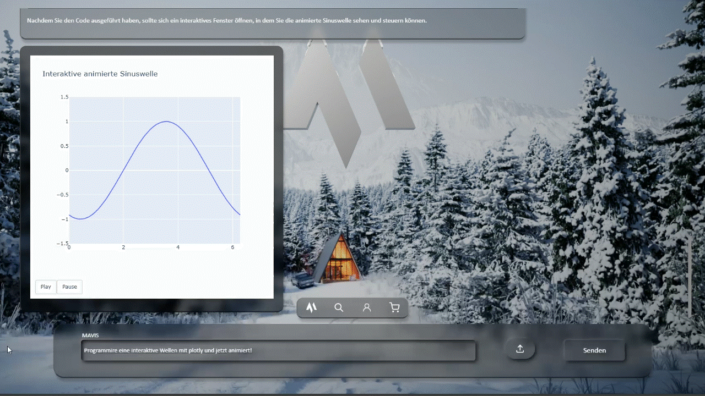
</div>

### Demo 10

**Aufgabe:** _Du bist ein Professioneller Thermodynamik Lehrer. Fasse mir die Übersicht zusammen in einer Tabelle (Formelsammlung) und lege dich ins Zeug!_

<div>
    
    
    
</div>

Grafik: https://www.ulrich-rapp.de/stoff/thermodynamik/Gasgesetz_AB.pdf

### Demo 9

**Task:** _In this task, students are to create a phase diagram for a binary mixed system that shows the phase transitions between the liquid and vapor phases. They use thermodynamic models and learn how to visualize complex phase diagrams using Python and the **Matplotlib** and **Seaborn** libraries._

_Use the Antoine equation to calculate the vapor pressure for each of the two components at a given temperature. The vapor pressure formula is:_

$$
P_A = P_A^0 \cdot x_A \quad \text{and} \quad P_B = P_B^0 \cdot x_B
$$

_Where_ $P_A^0$ _and_ $P_B^0$ _are the vapor pressures of the pure components at a given temperature_ $T$, _and_ $x_A$ _and_ $x_B$ _are the mole fractions of the two components in the liquid phase._

_**Given data:**_
_The vapor pressure parameters for the two components A and B at different temperatures are described by the **Antoine equation**. The corresponding constants for each component are:_

_**For component A**:_

- $A_A = 8.07131$

- $B_A = 1730.63$

- $C_A = 233.426$

_**For component B**:_

- $A_B = 8.14019$

- $B_B = 1810.94$

- $C_B = 244.485 $

_Good luck!_

<div>
    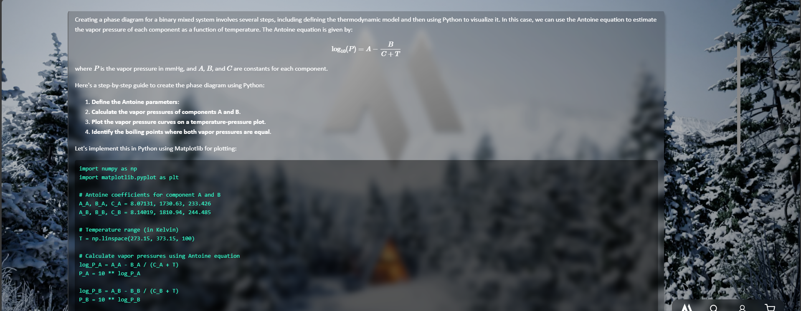
    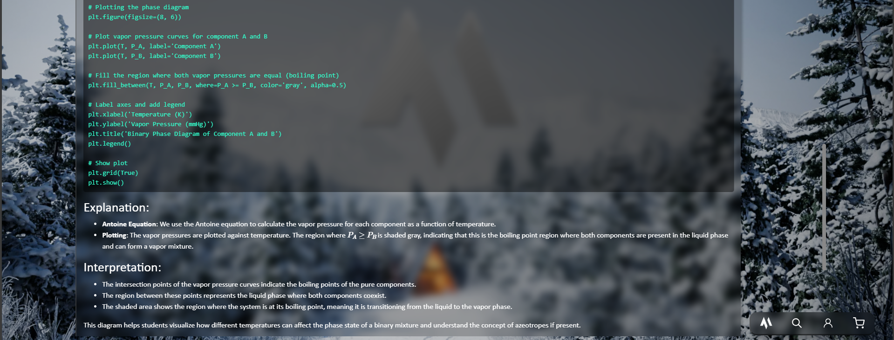
    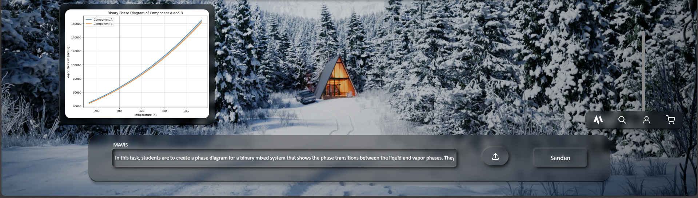
</div>

### Demo 8

<div>
    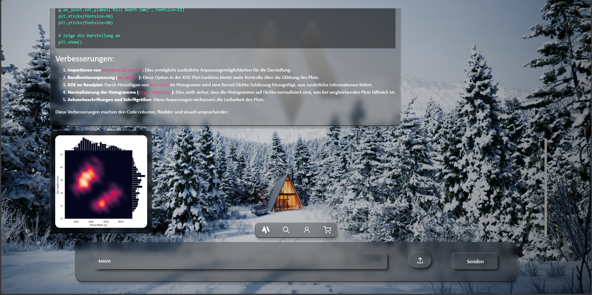
    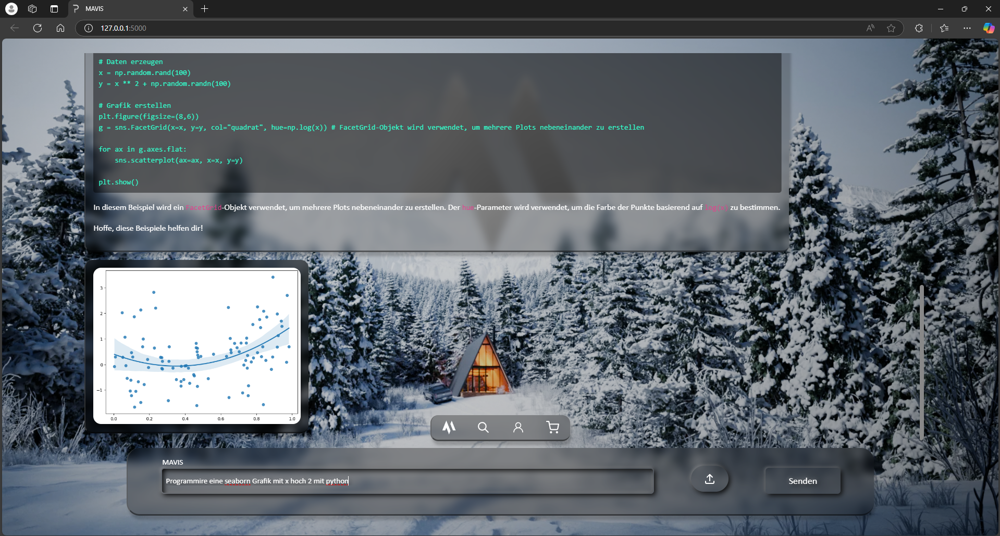
</div>

### Demo 7

<div>
    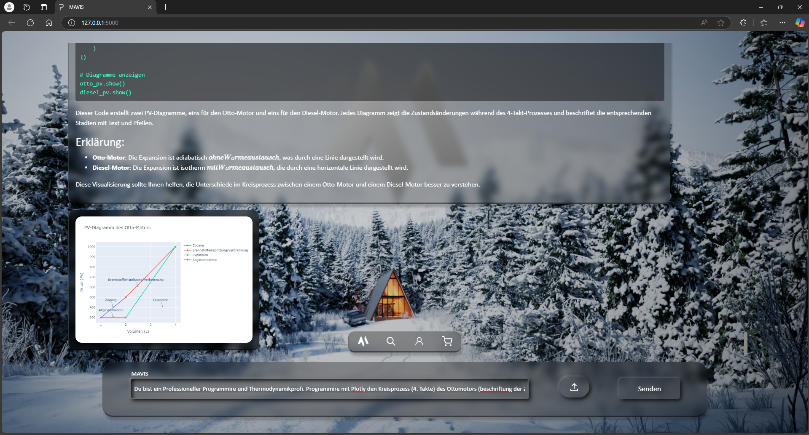
</div>

### Demo 6

<div>
    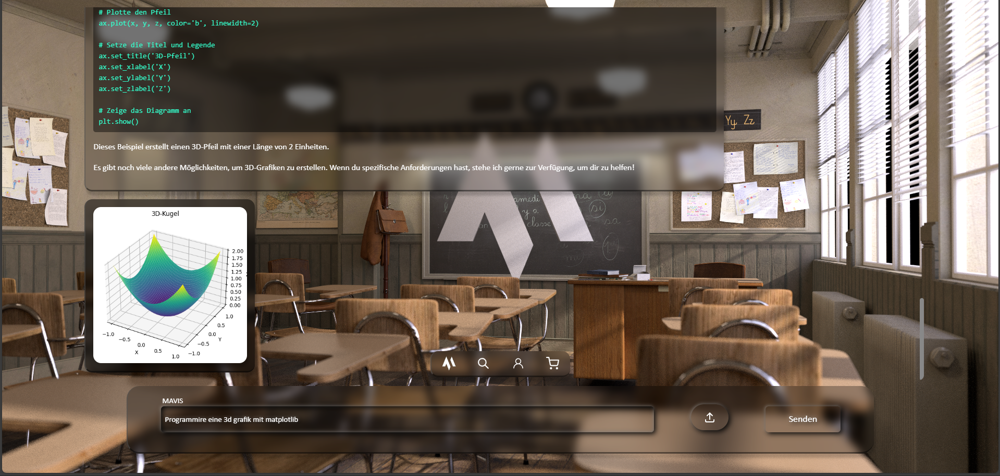
    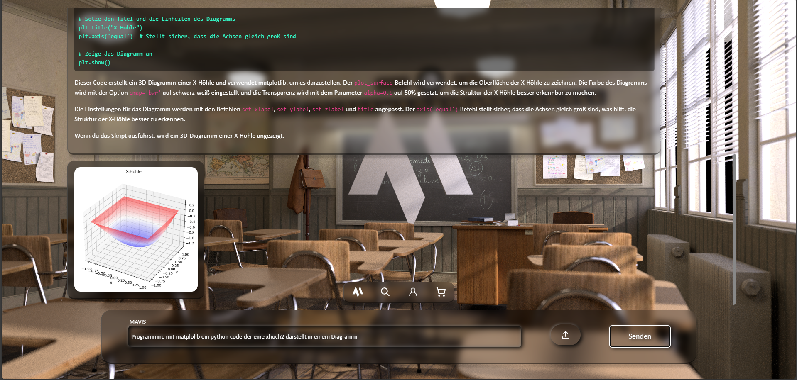
</div>

### Demo 5

<div>
    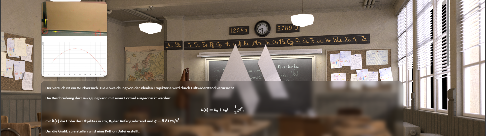
    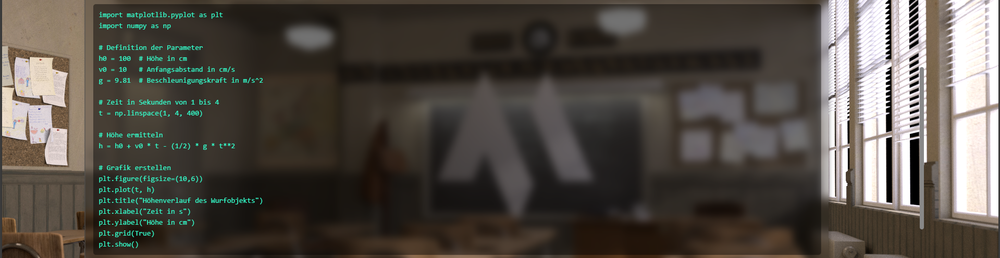
    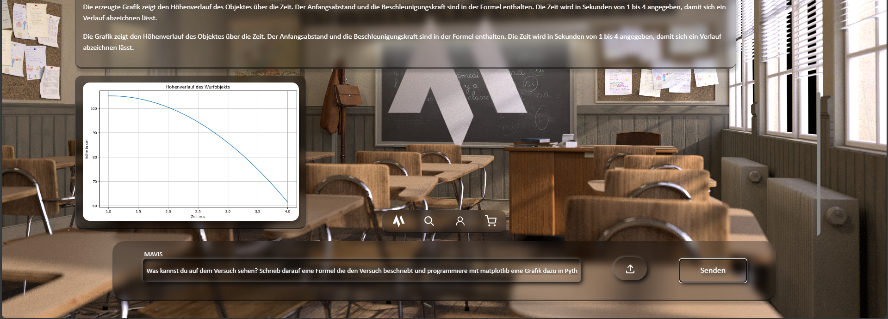
</div>

### Demo 4

<div>
  
  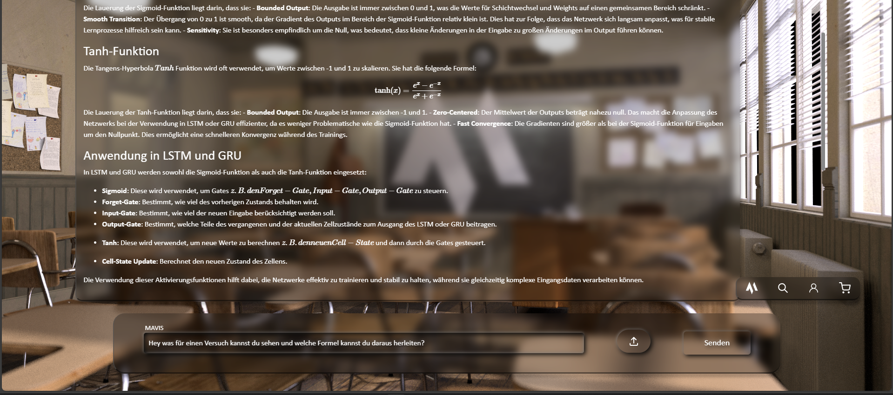
</div>

### Demo 3

<div>
    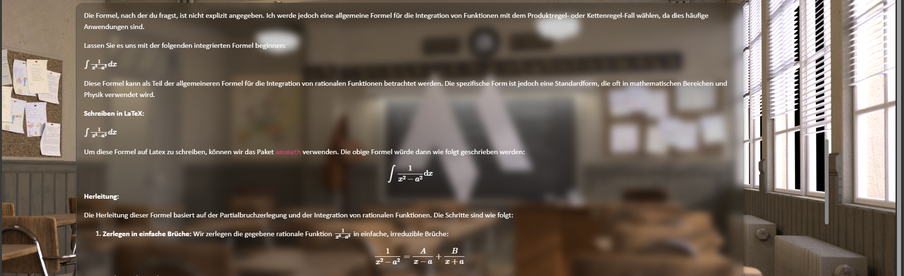
    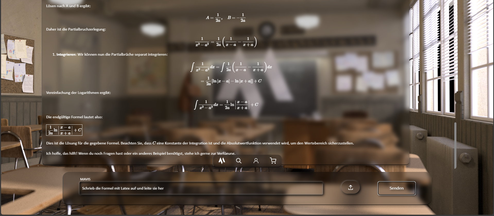
</div>

### Demo 2

<div>
    
    
</div>

### Demo 1

<div>
    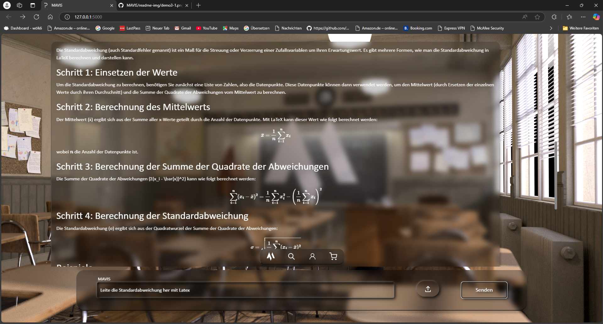
</div>

</details>


## Learn-MAVIS

> [Learn to install \ use MAVIS Installer; use MAVIS UI; use Latex; use Matplotlib](https://github.com/Peharge/MAVIS/blob/main/learn-mavis/README.md)<br>
> Soon: Use Plotly; Seaborn; Numpy; Sympy; PyTorch; Tensorflow; Sikit-Learn;  etc.

## Transformer

### 1. BERT: Pre-training of Deep Bidirectional Transformers for Language Understanding (2018)
**Authors:** Jacob Devlin, Ming-Wei Chang, Kenton Lee ...<br>
**Link:** [arXiv:1810.04805v2](https://arxiv.org/abs/1810.04805v2)  <br>
**Abstract:** We introduce a new language representation model called BERT, which stands for Bidirectional Encoder Representations from Transformers. Unlike recent language representation models, BERT is designed to pre-train deep bidirectional representations from unlabeled text by jointly conditioning on both left and right context in all layers. As a result, the pre-trained BERT model can be fine-tuned with just one additional output layer to create state-of-the-art models for a wide range of tasks, such as question answering and language inference, without substantial task-specific architecture modifications.
BERT is conceptually simple and empirically powerful. It obtains new state-of-the-art results on eleven natural language processing tasks, including pushing the GLUE score to 80.5% (7.7% point absolute improvement), MultiNLI accuracy to 86.7% (4.6% absolute improvement), SQuAD v1.1 question answering Test F1 to 93.2 (1.5 point absolute improvement) and SQuAD v2.0 Test F1 to 83.1 (5.1 point absolute improvement).

### 2. Evaluating Large Language Models Trained on Code (2021)
**Authors:** Mark Chen, Jerry Tworek, Heewoo Jun ...<br>
**Link:** [arXiv:2107.03374](https://arxiv.org/abs/2107.03374)  <br>
**Abstract:** We introduce Codex, a GPT language model fine-tuned on publicly available code from GitHub, and study its Python code-writing capabilities. A distinct production version of Codex powers GitHub Copilot. On HumanEval, a new evaluation set we release to measure functional correctness for synthesizing programs from docstrings, our model solves 28.8% of the problems, while GPT-3 solves 0% and GPT-J solves 11.4%. Furthermore, we find that repeated sampling from the model is a surprisingly effective strategy for producing working solutions to difficult prompts. Using this method, we solve 70.2% of our problems with 100 samples per problem. Careful investigation of our model reveals its limitations, including difficulty with docstrings describing long chains of operations and with binding operations to variables. Finally, we discuss the potential broader impacts of deploying powerful code generation technologies, covering safety, security, and economics.

### 3. Training language models to follow instructions with human feedback (2022)
**Authors:** Long Ouyang, Jeff Wu, Xu Jiang ...<br>
**Link:** [arXiv:2203.02155](https://arxiv.org/abs/2203.02155)  <br>
**Abstract:** Making language models bigger does not inherently make them better at following a user's intent. For example, large language models can generate outputs that are untruthful, toxic, or simply not helpful to the user. In other words, these models are not aligned with their users. In this paper, we show an avenue for aligning language models with user intent on a wide range of tasks by fine-tuning with human feedback. Starting with a set of labeler-written prompts and prompts submitted through the OpenAI API, we collect a dataset of labeler demonstrations of the desired model behavior, which we use to fine-tune GPT-3 using supervised learning. We then collect a dataset of rankings of model outputs, which we use to further fine-tune this supervised model using reinforcement learning from human feedback. We call the resulting models InstructGPT. In human evaluations on our prompt distribution, outputs from the 1.3B parameter InstructGPT model are preferred to outputs from the 175B GPT-3, despite having 100x fewer parameters. Moreover, InstructGPT models show improvements in truthfulness and reductions in toxic output generation while having minimal performance regressions on public NLP datasets. Even though InstructGPT still makes simple mistakes, our results show that fine-tuning with human feedback is a promising direction for aligning language models with human intent.

<details>
  <summary>more Paper</summary>

### 4. Aligning Books and Movies: Towards Story-like Visual Explanations by Watching Movies and Reading Books (2015)
**Authors:** Yukun Zhu, Ryan Kiros, Richard Zemel ...<br>
**Link:** [arXiv:1506.06724](https://arxiv.org/abs/1506.06724)  <br>
**Abstract:** This work presents a Neural Architecture Search (NAS) method using reinforcement learning to automatically generate neural network architectures. NAS demonstrates the ability to discover novel architectures that outperform human-designed models on standard benchmarks.

### 5. Language Models are Few-Shot Learners (2020)
**Authors:** Tom B. Brown, Benjamin Mann, Nick Ryder ...<br>
**Link:** [arXiv:2005.14165v4](https://arxiv.org/abs/2005.14165v4)  <br>
**Abstract:** Recent work has demonstrated substantial gains on many NLP tasks and benchmarks by pre-training on a large corpus of text followed by fine-tuning on a specific task. While typically task-agnostic in architecture, this method still requires task-specific fine-tuning datasets of thousands or tens of thousands of examples. By contrast, humans can generally perform a new language task from only a few examples or from simple instructions - something which current NLP systems still largely struggle to do. Here we show that scaling up language models greatly improves task-agnostic, few-shot performance, sometimes even reaching competitiveness with prior state-of-the-art fine-tuning approaches. Specifically, we train GPT-3, an autoregressive language model with 175 billion parameters, 10x more than any previous non-sparse language model, and test its performance in the few-shot setting. For all tasks, GPT-3 is applied without any gradient updates or fine-tuning, with tasks and few-shot demonstrations specified purely via text interaction with the model. GPT-3 achieves strong performance on many NLP datasets, including translation, question-answering, and cloze tasks, as well as several tasks that require on-the-fly reasoning or domain adaptation, such as unscrambling words, using a novel word in a sentence, or performing 3-digit arithmetic. At the same time, we also identify some datasets where GPT-3's few-shot learning still struggles, as well as some datasets where GPT-3 faces methodological issues related to training on large web corpora. Finally, we find that GPT-3 can generate samples of news articles which human evaluators have difficulty distinguishing from articles written by humans. We discuss broader societal impacts of this finding and of GPT-3 in general.

### 6. Visual ChatGPT: Talking, Drawing and Editing with Visual Foundation Models (2023)
**Authors:** Chenfei Wu, Shengming Yin, Weizhen Qi ...<br>
**Link:** [arXiv:2303.04671](https://arxiv.org/abs/2303.04671)  <br>
**Abstract:** ChatGPT is attracting a cross-field interest as it provides a language interface with remarkable conversational competency and reasoning capabilities across many domains. However, since ChatGPT is trained with languages, it is currently not capable of processing or generating images from the visual world. At the same time, Visual Foundation Models, such as Visual Transformers or Stable Diffusion, although showing great visual understanding and generation capabilities, they are only experts on specific tasks with one-round fixed inputs and outputs. To this end, We build a system called \textbf{Visual ChatGPT}, incorporating different Visual Foundation Models, to enable the user to interact with ChatGPT by 1) sending and receiving not only languages but also images 2) providing complex visual questions or visual editing instructions that require the collaboration of multiple AI models with multi-steps. 3) providing feedback and asking for corrected results. We design a series of prompts to inject the visual model information into ChatGPT, considering models of multiple inputs/outputs and models that require visual feedback. Experiments show that Visual ChatGPT opens the door to investigating the visual roles of ChatGPT with the help of Visual Foundation Models.

### 7. On the Opportunities and Risks of Foundation Models (2022)
**Authors:** Rishi Bommasani, Drew A. Hudson, Ehsan Adeli, Russ Altman ...<br>
**Link:** [arXiv:2108.07258](https://arxiv.org/abs/2108.07258)  <br>
**Abstract:** AI is undergoing a paradigm shift with the rise of models (e.g., BERT, DALL-E, GPT-3) that are trained on broad data at scale and are adaptable to a wide range of downstream tasks. We call these models foundation models to underscore their critically central yet incomplete character. This report provides a thorough account of the opportunities and risks of foundation models, ranging from their capabilities (e.g., language, vision, robotics, reasoning, human interaction) and technical principles(e.g., model architectures, training procedures, data, systems, security, evaluation, theory) to their applications (e.g., law, healthcare, education) and societal impact (e.g., inequity, misuse, economic and environmental impact, legal and ethical considerations). Though foundation models are based on standard deep learning and transfer learning, their scale results in new emergent capabilities,and their effectiveness across so many tasks incentivizes homogenization. Homogenization provides powerful leverage but demands caution, as the defects of the foundation model are inherited by all the adapted models downstream. Despite the impending widespread deployment of foundation models, we currently lack a clear understanding of how they work, when they fail, and what they are even capable of due to their emergent properties. To tackle these questions, we believe much of the critical research on foundation models will require deep interdisciplinary collaboration commensurate with their fundamentally sociotechnical nature.

### 8. Training language models to follow instructions with human feedback (2022)
**Authors:** Long Ouyang, Jeff Wu, Xu Jiang ...<br>
**Link:** [arXiv:2203.02155](https://arxiv.org/abs/2203.02155) <br> 
**Abstract:** Making language models bigger does not inherently make them better at following a user's intent. For example, large language models can generate outputs that are untruthful, toxic, or simply not helpful to the user. In other words, these models are not aligned with their users. In this paper, we show an avenue for aligning language models with user intent on a wide range of tasks by fine-tuning with human feedback. Starting with a set of labeler-written prompts and prompts submitted through the OpenAI API, we collect a dataset of labeler demonstrations of the desired model behavior, which we use to fine-tune GPT-3 using supervised learning. We then collect a dataset of rankings of model outputs, which we use to further fine-tune this supervised model using reinforcement learning from human feedback. We call the resulting models InstructGPT. In human evaluations on our prompt distribution, outputs from the 1.3B parameter InstructGPT model are preferred to outputs from the 175B GPT-3, despite having 100x fewer parameters. Moreover, InstructGPT models show improvements in truthfulness and reductions in toxic output generation while having minimal performance regressions on public NLP datasets. Even though InstructGPT still makes simple mistakes, our results show that fine-tuning with human feedback is a promising direction for aligning language models with human intent.

### 9. BioGPT: Generative Pre-trained Transformer for Biomedical Text Generation and Mining (2022)
**Authors:** Renqian Luo, Liai Sun, Yingce Xia ...<br>
**Link:** [arXiv:2210.10341](https://arxiv.org/abs/2210.10341)  <br>
**Abstract:** Pre-trained language models have attracted increasing attention in the biomedical domain, inspired by their great success in the general natural language domain. Among the two main branches of pre-trained language models in the general language domain, i.e., BERT (and its variants) and GPT (and its variants), the first one has been extensively studied in the biomedical domain, such as BioBERT and PubMedBERT. While they have achieved great success on a variety of discriminative downstream biomedical tasks, the lack of generation ability constrains their application scope. In this paper, we propose BioGPT, a domain-specific generative Transformer language model pre-trained on large scale biomedical literature. We evaluate BioGPT on six biomedical NLP tasks and demonstrate that our model outperforms previous models on most tasks. Especially, we get 44.98%, 38.42% and 40.76% F1 score on BC5CDR, KD-DTI and DDI end-to-end relation extraction tasks respectively, and 78.2% accuracy on PubMedQA, creating a new record. Our case study on text generation further demonstrates the advantage of BioGPT on biomedical literature to generate fluent descriptions for biomedical terms.

### 10. Release Strategies and the Social Impacts of Language Models (2019)
**Authors:** Irene Solaiman, Miles Brundage, Jack Clark ...<br>
**Link:** [arXiv:1908.09203](https://arxiv.org/abs/1908.09203)  <br>
**Abstract:** Large language models have a range of beneficial uses: they can assist in prose, poetry, and programming; analyze dataset biases; and more. However, their flexibility and generative capabilities also raise misuse concerns. This report discusses OpenAI's work related to the release of its GPT-2 language model. It discusses staged release, which allows time between model releases to conduct risk and benefit analyses as model sizes increased. It also discusses ongoing partnership-based research and provides recommendations for better coordination and responsible publication in AI.

### 11. WebGPT: Browser-assisted question-answering with human feedback (2022)
**Authors:**Reiichiro Nakano, Jacob Hilton, Suchir Balaji ...<br>
**Link:** [arXiv:2112.09332](https://arxiv.org/abs/2112.09332)  <br>
**Abstract:** We fine-tune GPT-3 to answer long-form questions using a text-based web-browsing environment, which allows the model to search and navigate the web. By setting up the task so that it can be performed by humans, we are able to train models on the task using imitation learning, and then optimize answer quality with human feedback. To make human evaluation of factual accuracy easier, models must collect references while browsing in support of their answers. We train and evaluate our models on ELI5, a dataset of questions asked by Reddit users. Our best model is obtained by fine-tuning GPT-3 using behavior cloning, and then performing rejection sampling against a reward model trained to predict human preferences. This model's answers are preferred by humans 56% of the time to those of our human demonstrators, and 69% of the time to the highest-voted answer from Reddit.

### 12. GPT-4 Technical Report (2023)
**Authors:** OpenAI, Josh Achiam, Steven Adler ...<br>
**Link:** [arXiv:2303.08774](https://arxiv.org/abs/2303.08774)  <br>
**Abstract:** We report the development of GPT-4, a large-scale, multimodal model which can accept image and text inputs and produce text outputs. While less capable than humans in many real-world scenarios, GPT-4 exhibits human-level performance on various professional and academic benchmarks, including passing a simulated bar exam with a score around the top 10% of test takers. GPT-4 is a Transformer-based model pre-trained to predict the next token in a document. The post-training alignment process results in improved performance on measures of factuality and adherence to desired behavior. A core component of this project was developing infrastructure and optimization methods that behave predictably across a wide range of scales. This allowed us to accurately predict some aspects of GPT-4's performance based on models trained with no more than 1/1,000th the compute of GPT-4.

### 13. Sparks of Artificial General Intelligence: Early experiments with GPT-4 (2023)
**Authors:** Sébastien Bubeck, Varun Chandrasekaran, Ronen Eldan ...<br>
**Link:** [arXiv:2303.12712](https://arxiv.org/abs/2303.12712)  <br>
**Abstract:** Artificial intelligence (AI) researchers have been developing and refining large language models (LLMs) that exhibit remarkable capabilities across a variety of domains and tasks, challenging our understanding of learning and cognition. The latest model developed by OpenAI, GPT-4, was trained using an unprecedented scale of compute and data. In this paper, we report on our investigation of an early version of GPT-4, when it was still in active development by OpenAI. We contend that (this early version of) GPT-4 is part of a new cohort of LLMs (along with ChatGPT and Google's PaLM for example) that exhibit more general intelligence than previous AI models. We discuss the rising capabilities and implications of these models. We demonstrate that, beyond its mastery of language, GPT-4 can solve novel and difficult tasks that span mathematics, coding, vision, medicine, law, psychology and more, without needing any special prompting. Moreover, in all of these tasks, GPT-4's performance is strikingly close to human-level performance, and often vastly surpasses prior models such as ChatGPT. Given the breadth and depth of GPT-4's capabilities, we believe that it could reasonably be viewed as an early (yet still incomplete) version of an artificial general intelligence (AGI) system. In our exploration of GPT-4, we put special emphasis on discovering its limitations, and we discuss the challenges ahead for advancing towards deeper and more comprehensive versions of AGI, including the possible need for pursuing a new paradigm that moves beyond next-word prediction. We conclude with reflections on societal influences of the recent technological leap and future research directions.<br>

> soon more...

</details>

## Lizenz

This project is licensed under the MIT license – see the [LICENSE](LICENSE) file for details.
