<p align="center">
    
</p>

<br>

<div align="center">


<br>
<br>


<br>
<br>


<br>
<br>


<br>
<br>


<br>
<br>

[](https://opensource.org/licenses/MIT)
<br>
</div>

# _MAVIS_
**MA**_th_ **V**_isual_ **I**_ntelligent_ **S**_ystem (Strongest calculator in the world)_

<div style="display: flex; justify-content: center; align-items: center; gap: 20px; flex-wrap: wrap;">
  
</div>

<br>

> ⚠️**Still in progress**⚠️

> **Deutsch**: MAVIS ist eine KI-gesteuerte Anwendung, die Ihnen ermöglicht, visuelle Daten wie Bilder (Formate: PNG, JPG, JPEG und GIF) zu analysieren und darauf basierend interaktive Antworten zu generieren. Mit MAVIS können Sie komplexe mathematische Berechnungen durchführen, programmiertechnische Aufgaben lösen und professionelle Grafiken erstellen.
> 
> Um optimale Ergebnisse zu erzielen, beachten Sie folgende Hinweise:
> 
> - Lassen Sie Formeln stets in LaTeX darstellen, um eine präzise und ansprechende Formatierung zu gewährleisten.
> 
> 
> - Fordern Sie MAVIS dazu auf, Code immer in Python zu schreiben, da nur dieser von der Benutzeroberfläche unterstützt wird.
> 
> 
> - Bitten Sie MAVIS, Grafiken mithilfe von Matplotlib zu erstellen, da die Benutzeroberfläche ausschließlich HTML, LaTeX und Python (Version 3.13 mit den Frameworks Matplotlib, NumPy, Math, SymPy und Pandas (bei Bedarf soon: PyTorch, TensorFlow, Keras, Scikit-Learn und Hugging Face Transformers (vielleicht noch JAX)) unterstützt.
> 
> Nutzen Sie die leistungsstarken Funktionen von MAVIS, um Ihre Projekte effizienter und professioneller zu gestalten.

<p align="center">
  
<p>

## _News_

- **[09.11.2024]** Start ;-)
- **[10.11.2024]** Available with Llama3.2 + [Demo](#demo-text) with Xc++ 2
- **[13.11.2024]** [Demo](#demo) UI
- **[21.11.2024]** MAVIS with Python (Version 3.13 with the frameworks Matplotlib, NumPy, Math, SymPy and Pandas) [Demo](#demo)

### _SOON_

- **[01.12.2024]** MAVIS EAP release

<br>

<div style="display: flex; justify-content: center; align-items: center; gap: 20px; flex-wrap: wrap;">
  
</div>

## _Updates_

### 1. MAVIS EAP release (with Llama 3.2)

<p align="center">
    
</p>

> 01.12.2024 

### 2. MAVIS releaseon MAC OS / Windows / Linux  

<p align="center">
     
</p>

> 01.06.2025
 
### 3. MAVIS on Apple Vision Pro                     
<p align="center">
     
</p>

> soon


<br>

<div style="display: flex; justify-content: center; align-items: center; gap: 20px; flex-wrap: wrap;">
  
</div>

## Table of contents
- [Versions](#versions)
- [Installation](#installation)
- [Usage](#using)
- [Xc++](#Xcpp)
- [Demo](#demo)
- [Demo Text](#demo-text)
- [History](#history)
- [Checklist](#checklist)
- [Design](#design)
- [Transformer](#transformer)
- [License](#lizenz)

---

## _Versions_

<div style="display: flex; justify-content: center; align-items: center; gap: 20px; flex-wrap: wrap;">
  
</div>

<br>

> ⚠️**Still in progress**⚠️

| **Model** | **Description**                                                                                       | **Parameters** |
|-------------|-------------------------------------------------------------------------------------------------------|---------------|
| Mavis 1 1B | With Llama 3.2 1B +6GB RAM +1.5GB storage (Works with one CPU)                                        | 1B |
| Mavis 1 3B | With Llama 3.2 2B +6GB +8GB RAM +2GB storage (Works with one CPU)                                     | 3B |
| Mavis 1 11B | With **Xc++ 2 11B** + Qwen 2.5 Coder 14B or Llama 3.2 11B +16GB RAM +9GB storage (Works with one CPU) | 11B |
| Mavis 1 90B | With **Xc++ 2 90B** + Qwen 2.5 Coder 32B or Llama 3.2 90B +128GB RAM +60GB storage (Works with one CPU) | 90B |

<br>

<div style="display: flex; justify-content: center; align-items: center; gap: 20px; flex-wrap: wrap;">
  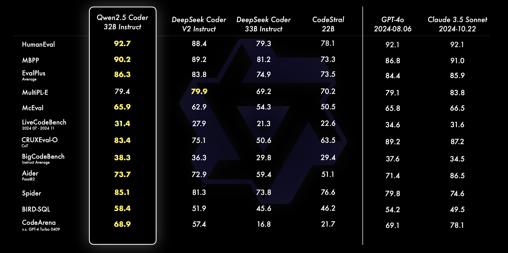
</div>

## _Peharge_

<div style="display: flex; justify-content: center; align-items: center; gap: 20px; flex-wrap: wrap;">
  
</div>

<br>

> ⚠️**Still in progress**⚠️

## _Peharge Program 2024-2025_

<div style="display: flex; justify-content: center; align-items: center; gap: 20px; flex-wrap: wrap;">
  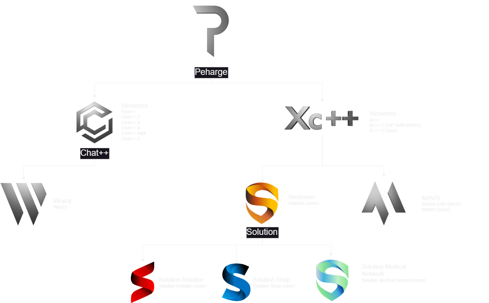
</div>

<br>

> ⚠️**Still in progress**⚠️

## _Installation_

<div style="display: flex; justify-content: center; align-items: center; gap: 20px; flex-wrap: wrap;">
  
</div>

<br>

> ⚠️**Still in progress**⚠️

### Deutsch:

**MAVIS (alias Xc++ 2)** befindet sich derzeit in der Entwicklung und ist in diesem Repository nicht vollständig verfügbar. Durch das Klonen des Repositories erhalten Sie lediglich die README-Datei, einige Bilder und bereits veröffentlichte Codes, einschließlich der Benutzeroberfläche (UI), die mit **Qwen 2.5 Code** und **Llama 3.2 Vision** kompatibel ist.

### Voraussetzungen

Um MAVIS erfolgreich zu installieren, benötigen Sie die folgenden Programme:

1. **Git**  
   Laden Sie Git von der offiziellen Website herunter:  
   [https://git-scm.com](https://git-scm.com)

2. **Python**  
   - Empfohlen: **Python 3.13** (auch 3.12 oder 3.11 werden unterstützt).  
   - Laden Sie Python von der [https://www.python.org](https://www.python.org) oder über den Microsoft Store herunter.

3. **Python-Entwicklungsumgebung (IDE) (Muss aber nicht sein)**  
   Eine geeignete IDE erleichtert die Entwicklung und Arbeit mit Python. Empfehlenswerte Optionen:  
   - **Visual Studio Code (kostenlos)**: [https://code.visualstudio.com](https://code.visualstudio.com)  
   - **PyCharm (kostenpflichtig)**: [https://www.jetbrains.com/de-de/pycharm/](https://www.jetbrains.com/de-de/pycharm/)  
     *Hinweis:* PyCharm bietet erweiterte Funktionen für die Python-Entwicklung und ist besonders für fortgeschrittene Nutzer geeignet.

### Installation

1. **Repository klonen**  
   Klonen Sie das Repository in ein lokales Verzeichnis:
   ```bash
   git clone https://github.com/Peharge/MAVIS
   ```
2. **In das Verzeichnis wechseln**  
   Navigieren Sie in das Projektverzeichnis:
   ```bash
   cd MAVIS
   ```
3. **Virtuelle Python-Umgebung erstellen**  
   Richten Sie eine virtuelle Umgebung ein, um Abhängigkeiten isoliert zu installieren:
   ```bash
   python -m venv env
   ```
   *(Sie können `env` durch einen anderen Namen ersetzen.)*

4. **Virtuelle Umgebung aktivieren**  
   Aktivieren Sie die virtuelle Umgebung:
   - **Für CMD**:
     ```bash
     env\Scripts\activate
     ```
   - **Für PowerShell**:
     ```bash
     .\env\Scripts\Activate
     ```
     
5. **Abhängigkeiten installieren**  
   Installieren Sie die benötigten Bibliotheken:
   ```bash
   pip install flask ollama markdown psutil gputil numpy matplotlib math sympy pandas
   ```

### Benutzeroberfläche starten

1. **Starten der UI**  
   Sie können die Benutzeroberfläche auf zwei Arten starten:  
   - Mit einer Batch-Datei:  
     - `run-main.bat` (empfohlen)  
     - `run-main2.bat` (für Tests)  
     - `run-main3.bat` (für Tests)  
   - Alternativ über das Python-Skript:  
     ```bash
     python main-main.py
     ```
     *Hinweis:* Prüfen Sie, welches Skript (`main[1-24].py`) für Ihre Anforderungen am besten geeignet ist.

2. **Zugriff auf die Benutzeroberfläche**  
   Nach dem Start der UI gibt Flask eine URL im Terminal aus.  
   - Öffnen Sie diese URL in Ihrem Browser (unter PowerShell mit `Strg + Klick` direkt anklickbar).  
   - Die MAVIS-Benutzeroberfläche sollte im Browser angezeigt werden.

3. **Virtuelle Umgebung deaktivieren**  
   Nach Abschluss können Sie die virtuelle Umgebung mit dem folgenden Befehl deaktivieren:
   ```bash
   deactivate
   ```
   

## **Alternative Modelle für MAVIS**

<div style="display: flex; justify-content: center; align-items: center; gap: 20px; flex-wrap: wrap;">
  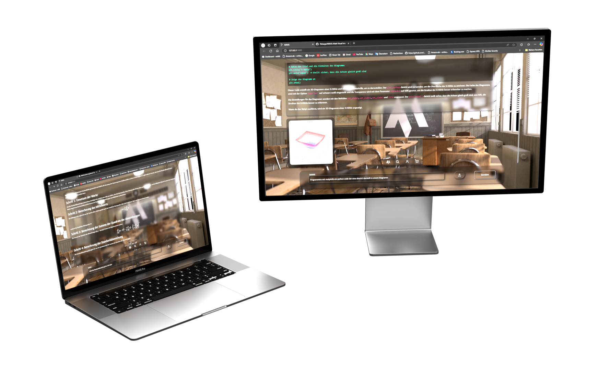
</div>

<br>

> ⚠️**Still in progress**⚠️

Da **Xc++ 2** noch nicht veröffentlicht wurde, können Sie stattdessen folgende Modelle verwenden:

*Um die Modelle von Ollama zu installieren, benötigen Sie die Ollama-App: [https://ollama.com/download](https://ollama.com/download).<br>
Nach der Installation müssen Sie die App immer starten, um die Modelle verwenden zu können.*

1. **Llama 3.2 Vision**
   Installieren Sie dieses Modell über Ollama:
   - **Für MAVIS 11B**:
     ```bash
     ollama run llama3.2-vision
     ```
   - **Für MAVIS 90B**:
     ```bash
     ollama run llama3.2-vision:90b
     ```

2. **Qwen 2.5 Coder** (ohne Vision)  
   Dieses Modell ist für reinen Code-Betrieb optimiert:
   - **Für MAVIS 11B**:
     ```bash
     ollama run qwen2.5-coder:14b
     ```
   - **Für MAVIS 90B**:
     ```bash
     ollama run qwen2.5-coder:32b
     ```

### Viel Spaß mit MAVIS 🚀

## _Using_

<div style="display: flex; justify-content: center; align-items: center; gap: 20px; flex-wrap: wrap;">
  
</div>

<br>

> ⚠️**Still in progress**⚠️

## Xcpp

<div style="display: flex; justify-content: center; align-items: center; gap: 20px; flex-wrap: wrap;">
  
</div>

<br>

> ⚠️**Still in progress**⚠️

## Demo

<div style="display: flex; justify-content: center; align-items: center; gap: 20px; flex-wrap: wrap;">
  
</div>

### Demo 6

<div>
    
    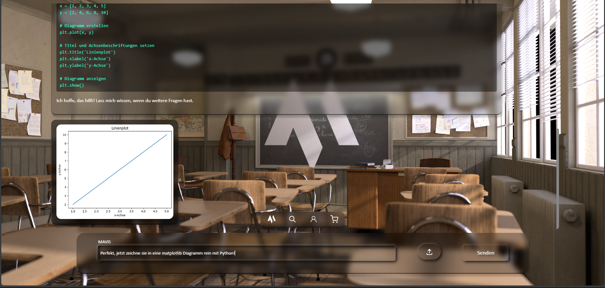
    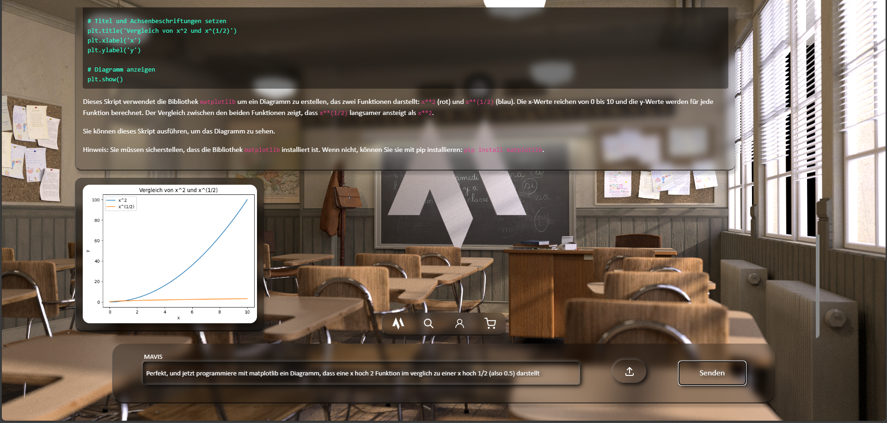
    
    
    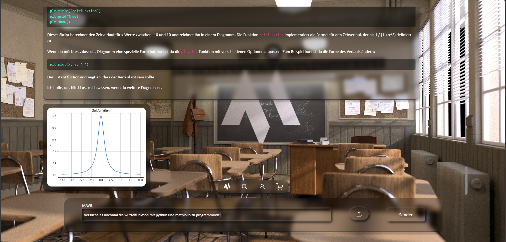
    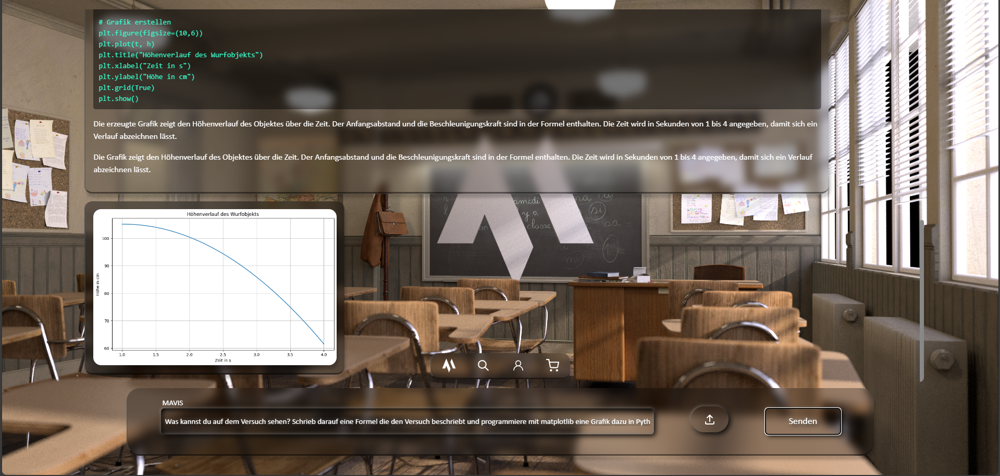
</div>

### Demo 5

<div>
    
    
    
</div>

### Demo 4

<div>
  
  
</div>

### Demo 3

<div>
    
    
    
</div>
<div>
    
    
</div>
<div>
    
</div>

### Demo 2

<div style="display: flex; justify-content: center; align-items: center; gap: 20px; flex-wrap: wrap;">
  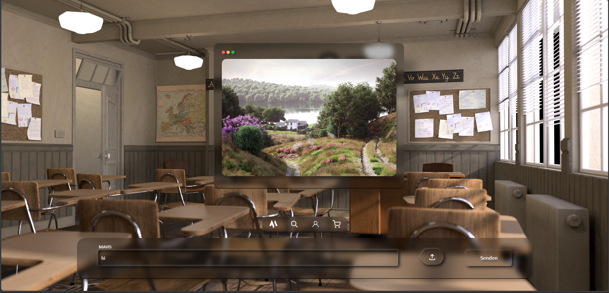
</div>
<div style="display: flex; justify-content: center; align-items: center; gap: 20px; flex-wrap: wrap;">
  
</div>
<div style="display: flex; justify-content: center; align-items: center; gap: 20px; flex-wrap: wrap;">
  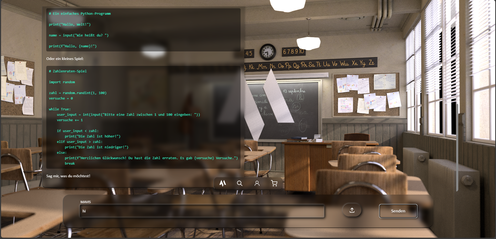
</div>
<div style="display: flex; justify-content: center; align-items: center; gap: 20px; flex-wrap: wrap;">
  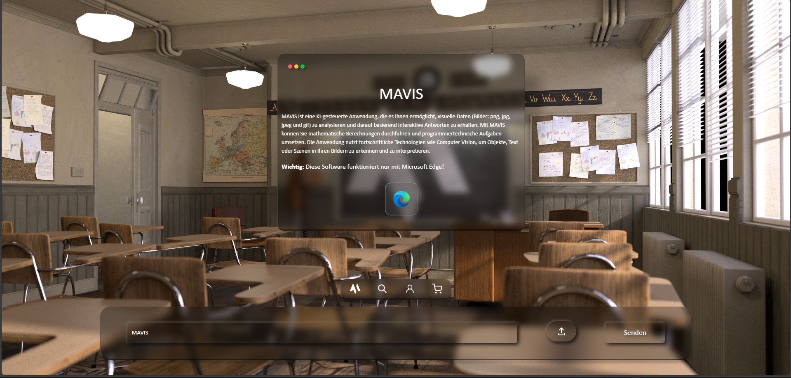
</div>

### Demo 1

<div>
  
  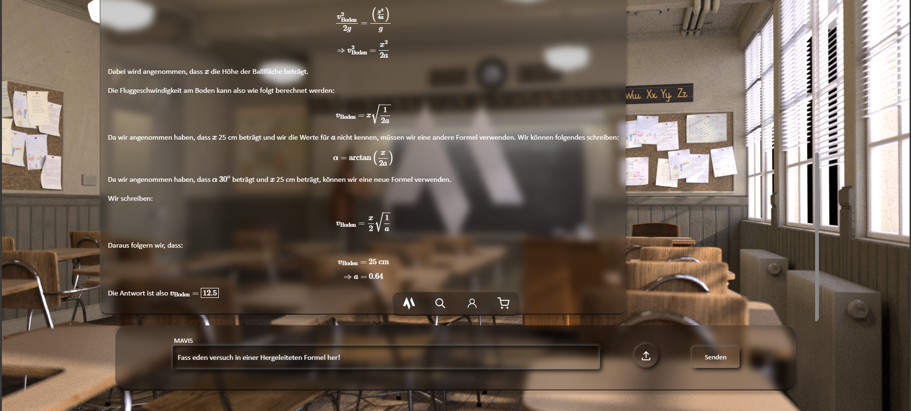
</div>

## Demo-text

> ⚠️**Still in progress**⚠️

## History

<p align="center">
  
</p>

<br>

> ⚠️**Still in progress**⚠️

## Checklist

<div style="display: flex; justify-content: center; align-items: center; gap: 20px; flex-wrap: wrap;">
  
</div>

<br>

> ⚠️**Still in progress**⚠️

Here is the to-do list for the most important tools and tasks in the project:

## Tasks

| **Task** | **Description** | **Status** |
|----------|------------------|------------|
| Task 1 |                  | ❌          |

Not done ❌ | Done (min. 1 month) ✔️ | Improvements needed 🔧 | In progress 🔄 | Improvements needed ⚠️

## Design

<p align="center">
  
<p>

<div style="display: flex; justify-content: center; align-items: center; gap: 20px; flex-wrap: wrap;">
  
</div>

<br>

> ⚠️**Still in progress**⚠️

## Transformer

### 1. BERT: Pre-training of Deep Bidirectional Transformers for Language Understanding (2018)
**Authors:** Jacob Devlin, Ming-Wei Chang, Kenton Lee ...<br>
**Link:** [arXiv:1810.04805v2](https://arxiv.org/abs/1810.04805v2)  <br>
**Abstract:** We introduce a new language representation model called BERT, which stands for Bidirectional Encoder Representations from Transformers. Unlike recent language representation models, BERT is designed to pre-train deep bidirectional representations from unlabeled text by jointly conditioning on both left and right context in all layers. As a result, the pre-trained BERT model can be fine-tuned with just one additional output layer to create state-of-the-art models for a wide range of tasks, such as question answering and language inference, without substantial task-specific architecture modifications.
BERT is conceptually simple and empirically powerful. It obtains new state-of-the-art results on eleven natural language processing tasks, including pushing the GLUE score to 80.5% (7.7% point absolute improvement), MultiNLI accuracy to 86.7% (4.6% absolute improvement), SQuAD v1.1 question answering Test F1 to 93.2 (1.5 point absolute improvement) and SQuAD v2.0 Test F1 to 83.1 (5.1 point absolute improvement).

### 2. Evaluating Large Language Models Trained on Code (2021)
**Authors:** Mark Chen, Jerry Tworek, Heewoo Jun ...<br>
**Link:** [arXiv:2107.03374](https://arxiv.org/abs/2107.03374)  <br>
**Abstract:** We introduce Codex, a GPT language model fine-tuned on publicly available code from GitHub, and study its Python code-writing capabilities. A distinct production version of Codex powers GitHub Copilot. On HumanEval, a new evaluation set we release to measure functional correctness for synthesizing programs from docstrings, our model solves 28.8% of the problems, while GPT-3 solves 0% and GPT-J solves 11.4%. Furthermore, we find that repeated sampling from the model is a surprisingly effective strategy for producing working solutions to difficult prompts. Using this method, we solve 70.2% of our problems with 100 samples per problem. Careful investigation of our model reveals its limitations, including difficulty with docstrings describing long chains of operations and with binding operations to variables. Finally, we discuss the potential broader impacts of deploying powerful code generation technologies, covering safety, security, and economics.

### 3. Training language models to follow instructions with human feedback (2022)
**Authors:** Long Ouyang, Jeff Wu, Xu Jiang ...<br>
**Link:** [arXiv:2203.02155](https://arxiv.org/abs/2203.02155)  <br>
**Abstract:** Making language models bigger does not inherently make them better at following a user's intent. For example, large language models can generate outputs that are untruthful, toxic, or simply not helpful to the user. In other words, these models are not aligned with their users. In this paper, we show an avenue for aligning language models with user intent on a wide range of tasks by fine-tuning with human feedback. Starting with a set of labeler-written prompts and prompts submitted through the OpenAI API, we collect a dataset of labeler demonstrations of the desired model behavior, which we use to fine-tune GPT-3 using supervised learning. We then collect a dataset of rankings of model outputs, which we use to further fine-tune this supervised model using reinforcement learning from human feedback. We call the resulting models InstructGPT. In human evaluations on our prompt distribution, outputs from the 1.3B parameter InstructGPT model are preferred to outputs from the 175B GPT-3, despite having 100x fewer parameters. Moreover, InstructGPT models show improvements in truthfulness and reductions in toxic output generation while having minimal performance regressions on public NLP datasets. Even though InstructGPT still makes simple mistakes, our results show that fine-tuning with human feedback is a promising direction for aligning language models with human intent.

### 4. Aligning Books and Movies: Towards Story-like Visual Explanations by Watching Movies and Reading Books (2015)
**Authors:** Yukun Zhu, Ryan Kiros, Richard Zemel ...<br>
**Link:** [arXiv:1506.06724](https://arxiv.org/abs/1506.06724)  <br>
**Abstract:** This work presents a Neural Architecture Search (NAS) method using reinforcement learning to automatically generate neural network architectures. NAS demonstrates the ability to discover novel architectures that outperform human-designed models on standard benchmarks.

### 5. Language Models are Few-Shot Learners (2020)
**Authors:** Tom B. Brown, Benjamin Mann, Nick Ryder ...<br>
**Link:** [arXiv:2005.14165v4](https://arxiv.org/abs/2005.14165v4)  <br>
**Abstract:** Recent work has demonstrated substantial gains on many NLP tasks and benchmarks by pre-training on a large corpus of text followed by fine-tuning on a specific task. While typically task-agnostic in architecture, this method still requires task-specific fine-tuning datasets of thousands or tens of thousands of examples. By contrast, humans can generally perform a new language task from only a few examples or from simple instructions - something which current NLP systems still largely struggle to do. Here we show that scaling up language models greatly improves task-agnostic, few-shot performance, sometimes even reaching competitiveness with prior state-of-the-art fine-tuning approaches. Specifically, we train GPT-3, an autoregressive language model with 175 billion parameters, 10x more than any previous non-sparse language model, and test its performance in the few-shot setting. For all tasks, GPT-3 is applied without any gradient updates or fine-tuning, with tasks and few-shot demonstrations specified purely via text interaction with the model. GPT-3 achieves strong performance on many NLP datasets, including translation, question-answering, and cloze tasks, as well as several tasks that require on-the-fly reasoning or domain adaptation, such as unscrambling words, using a novel word in a sentence, or performing 3-digit arithmetic. At the same time, we also identify some datasets where GPT-3's few-shot learning still struggles, as well as some datasets where GPT-3 faces methodological issues related to training on large web corpora. Finally, we find that GPT-3 can generate samples of news articles which human evaluators have difficulty distinguishing from articles written by humans. We discuss broader societal impacts of this finding and of GPT-3 in general.

### 6. Visual ChatGPT: Talking, Drawing and Editing with Visual Foundation Models (2023)
**Authors:** Chenfei Wu, Shengming Yin, Weizhen Qi ...<br>
**Link:** [arXiv:2303.04671](https://arxiv.org/abs/2303.04671)  <br>
**Abstract:** ChatGPT is attracting a cross-field interest as it provides a language interface with remarkable conversational competency and reasoning capabilities across many domains. However, since ChatGPT is trained with languages, it is currently not capable of processing or generating images from the visual world. At the same time, Visual Foundation Models, such as Visual Transformers or Stable Diffusion, although showing great visual understanding and generation capabilities, they are only experts on specific tasks with one-round fixed inputs and outputs. To this end, We build a system called \textbf{Visual ChatGPT}, incorporating different Visual Foundation Models, to enable the user to interact with ChatGPT by 1) sending and receiving not only languages but also images 2) providing complex visual questions or visual editing instructions that require the collaboration of multiple AI models with multi-steps. 3) providing feedback and asking for corrected results. We design a series of prompts to inject the visual model information into ChatGPT, considering models of multiple inputs/outputs and models that require visual feedback. Experiments show that Visual ChatGPT opens the door to investigating the visual roles of ChatGPT with the help of Visual Foundation Models.

### 7. On the Opportunities and Risks of Foundation Models (2022)
**Authors:** Rishi Bommasani, Drew A. Hudson, Ehsan Adeli, Russ Altman ...<br>
**Link:** [arXiv:2108.07258](https://arxiv.org/abs/2108.07258)  <br>
**Abstract:** AI is undergoing a paradigm shift with the rise of models (e.g., BERT, DALL-E, GPT-3) that are trained on broad data at scale and are adaptable to a wide range of downstream tasks. We call these models foundation models to underscore their critically central yet incomplete character. This report provides a thorough account of the opportunities and risks of foundation models, ranging from their capabilities (e.g., language, vision, robotics, reasoning, human interaction) and technical principles(e.g., model architectures, training procedures, data, systems, security, evaluation, theory) to their applications (e.g., law, healthcare, education) and societal impact (e.g., inequity, misuse, economic and environmental impact, legal and ethical considerations). Though foundation models are based on standard deep learning and transfer learning, their scale results in new emergent capabilities,and their effectiveness across so many tasks incentivizes homogenization. Homogenization provides powerful leverage but demands caution, as the defects of the foundation model are inherited by all the adapted models downstream. Despite the impending widespread deployment of foundation models, we currently lack a clear understanding of how they work, when they fail, and what they are even capable of due to their emergent properties. To tackle these questions, we believe much of the critical research on foundation models will require deep interdisciplinary collaboration commensurate with their fundamentally sociotechnical nature.

### 8. Training language models to follow instructions with human feedback (2022)
**Authors:** Long Ouyang, Jeff Wu, Xu Jiang ...<br>
**Link:** [arXiv:2203.02155](https://arxiv.org/abs/2203.02155) <br> 
**Abstract:** Making language models bigger does not inherently make them better at following a user's intent. For example, large language models can generate outputs that are untruthful, toxic, or simply not helpful to the user. In other words, these models are not aligned with their users. In this paper, we show an avenue for aligning language models with user intent on a wide range of tasks by fine-tuning with human feedback. Starting with a set of labeler-written prompts and prompts submitted through the OpenAI API, we collect a dataset of labeler demonstrations of the desired model behavior, which we use to fine-tune GPT-3 using supervised learning. We then collect a dataset of rankings of model outputs, which we use to further fine-tune this supervised model using reinforcement learning from human feedback. We call the resulting models InstructGPT. In human evaluations on our prompt distribution, outputs from the 1.3B parameter InstructGPT model are preferred to outputs from the 175B GPT-3, despite having 100x fewer parameters. Moreover, InstructGPT models show improvements in truthfulness and reductions in toxic output generation while having minimal performance regressions on public NLP datasets. Even though InstructGPT still makes simple mistakes, our results show that fine-tuning with human feedback is a promising direction for aligning language models with human intent.

### 9. BioGPT: Generative Pre-trained Transformer for Biomedical Text Generation and Mining (2022)
**Authors:** Renqian Luo, Liai Sun, Yingce Xia ...<br>
**Link:** [arXiv:2210.10341](https://arxiv.org/abs/2210.10341)  <br>
**Abstract:** Pre-trained language models have attracted increasing attention in the biomedical domain, inspired by their great success in the general natural language domain. Among the two main branches of pre-trained language models in the general language domain, i.e., BERT (and its variants) and GPT (and its variants), the first one has been extensively studied in the biomedical domain, such as BioBERT and PubMedBERT. While they have achieved great success on a variety of discriminative downstream biomedical tasks, the lack of generation ability constrains their application scope. In this paper, we propose BioGPT, a domain-specific generative Transformer language model pre-trained on large scale biomedical literature. We evaluate BioGPT on six biomedical NLP tasks and demonstrate that our model outperforms previous models on most tasks. Especially, we get 44.98%, 38.42% and 40.76% F1 score on BC5CDR, KD-DTI and DDI end-to-end relation extraction tasks respectively, and 78.2% accuracy on PubMedQA, creating a new record. Our case study on text generation further demonstrates the advantage of BioGPT on biomedical literature to generate fluent descriptions for biomedical terms.

### 10. Release Strategies and the Social Impacts of Language Models (2019)
**Authors:** Irene Solaiman, Miles Brundage, Jack Clark ...<br>
**Link:** [arXiv:1908.09203](https://arxiv.org/abs/1908.09203)  <br>
**Abstract:** Large language models have a range of beneficial uses: they can assist in prose, poetry, and programming; analyze dataset biases; and more. However, their flexibility and generative capabilities also raise misuse concerns. This report discusses OpenAI's work related to the release of its GPT-2 language model. It discusses staged release, which allows time between model releases to conduct risk and benefit analyses as model sizes increased. It also discusses ongoing partnership-based research and provides recommendations for better coordination and responsible publication in AI.

### 11. WebGPT: Browser-assisted question-answering with human feedback (2022)
**Authors:**Reiichiro Nakano, Jacob Hilton, Suchir Balaji ...<br>
**Link:** [arXiv:2112.09332](https://arxiv.org/abs/2112.09332)  <br>
**Abstract:** We fine-tune GPT-3 to answer long-form questions using a text-based web-browsing environment, which allows the model to search and navigate the web. By setting up the task so that it can be performed by humans, we are able to train models on the task using imitation learning, and then optimize answer quality with human feedback. To make human evaluation of factual accuracy easier, models must collect references while browsing in support of their answers. We train and evaluate our models on ELI5, a dataset of questions asked by Reddit users. Our best model is obtained by fine-tuning GPT-3 using behavior cloning, and then performing rejection sampling against a reward model trained to predict human preferences. This model's answers are preferred by humans 56% of the time to those of our human demonstrators, and 69% of the time to the highest-voted answer from Reddit.

### 12. GPT-4 Technical Report (2023)
**Authors:** OpenAI, Josh Achiam, Steven Adler ...<br>
**Link:** [arXiv:2303.08774](https://arxiv.org/abs/2303.08774)  <br>
**Abstract:** We report the development of GPT-4, a large-scale, multimodal model which can accept image and text inputs and produce text outputs. While less capable than humans in many real-world scenarios, GPT-4 exhibits human-level performance on various professional and academic benchmarks, including passing a simulated bar exam with a score around the top 10% of test takers. GPT-4 is a Transformer-based model pre-trained to predict the next token in a document. The post-training alignment process results in improved performance on measures of factuality and adherence to desired behavior. A core component of this project was developing infrastructure and optimization methods that behave predictably across a wide range of scales. This allowed us to accurately predict some aspects of GPT-4's performance based on models trained with no more than 1/1,000th the compute of GPT-4.

### 13. Sparks of Artificial General Intelligence: Early experiments with GPT-4 (2023)
**Authors:** Sébastien Bubeck, Varun Chandrasekaran, Ronen Eldan ...<br>
**Link:** [arXiv:2303.12712](https://arxiv.org/abs/2303.12712)  <br>
**Abstract:** Artificial intelligence (AI) researchers have been developing and refining large language models (LLMs) that exhibit remarkable capabilities across a variety of domains and tasks, challenging our understanding of learning and cognition. The latest model developed by OpenAI, GPT-4, was trained using an unprecedented scale of compute and data. In this paper, we report on our investigation of an early version of GPT-4, when it was still in active development by OpenAI. We contend that (this early version of) GPT-4 is part of a new cohort of LLMs (along with ChatGPT and Google's PaLM for example) that exhibit more general intelligence than previous AI models. We discuss the rising capabilities and implications of these models. We demonstrate that, beyond its mastery of language, GPT-4 can solve novel and difficult tasks that span mathematics, coding, vision, medicine, law, psychology and more, without needing any special prompting. Moreover, in all of these tasks, GPT-4's performance is strikingly close to human-level performance, and often vastly surpasses prior models such as ChatGPT. Given the breadth and depth of GPT-4's capabilities, we believe that it could reasonably be viewed as an early (yet still incomplete) version of an artificial general intelligence (AGI) system. In our exploration of GPT-4, we put special emphasis on discovering its limitations, and we discuss the challenges ahead for advancing towards deeper and more comprehensive versions of AGI, including the possible need for pursuing a new paradigm that moves beyond next-word prediction. We conclude with reflections on societal influences of the recent technological leap and future research directions.<br>

> soon more...

## Lizenz

This project is licensed under the MIT license – see the [LICENSE](LICENSE) file for details.

<div style="display: flex; justify-content: center; align-items: center; gap: 20px; flex-wrap: wrap;">
  
</div>

<br>
