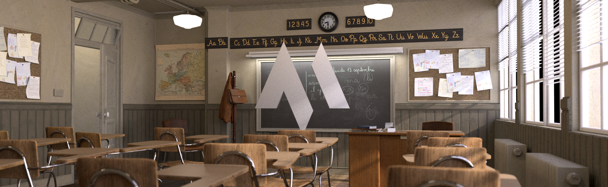
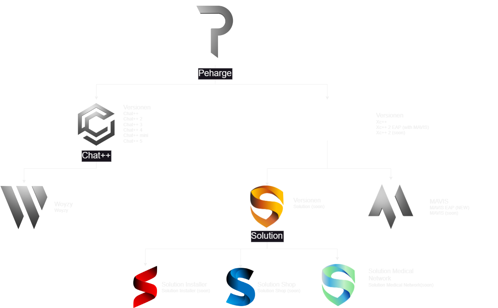

    

 

 
 

 
 

 
 

 
 

 
 

 

# MAVIS

> Math Visual Intelligent System

  

## News

- **[2024.11.09]** Start ;-)
- **[2024.11.10]** Erhältlich mit Llama3.2 + [Demo](#demo-text) mit Xc++ 2
- **[2024.11.13]** [Demo](#demo)

## Inhaltsverzeichnis
- [Versionen](#versionen)
- [Installation](#installation)
- [Benutzung](#benutzung)
- [Xc++](#Xcpp)
- [Demo](#demo)
- [Demo Text](#demo-text)
- [Geschichte](#geschichte)
- [Checkliste](#checkliste)
- [Design](#design)
- [Transformer](#transformer)
- [Lizenz](#lizenz)

---

# _Peharge Program 2024-2025_

  

## Versionen

  

 

| **Model**   | **Beschreibung**                                                                                 | **Parameter** |
|-------------|--------------------------------------------------------------------------------------------------|---------------|
| Mavis 1 1B  | Mit Llama 3.2 1B   +6GB RAM +1.5GB storage (Funktioniert mit einer CPU)                       | 1B            |
| Mavis 1 3B  | Mit Llama 3.2 2B   +6GB +8GB RAM +2GB storage (Funktioniert mit einer CPU)                    | 3B            |
| Mavis 1 11B | Mit **Xc++ 2 11B** oder Llama 3.2 11B   +16GB RAM +9GB storage (Funktioniert mit einer CPU)   | 11B           |
| Mavis 1 90B | Mit **Xc++ 2 90B** oder Llama 3.2 90B   +128GB RAM +60GB storage (Funktioniert mit einer CPU) | 90B           |

## Installation

  

soon ...

## Benutzung

soon ...

## Xcpp

soon ...

### Llama

## Demo

  

  

  

  

  

  

## Demo-text

soon ...

## Geschichte

soon ...

## Checkliste

soon ...

## Aufgaben

soon ...

## Design

soon ...

## Transformer

soon ...

## Lizenz

Dieses Projekt ist unter der MIT-Lizenz lizenziert – siehe die [LICENSE](LICENSE) Datei für Details.