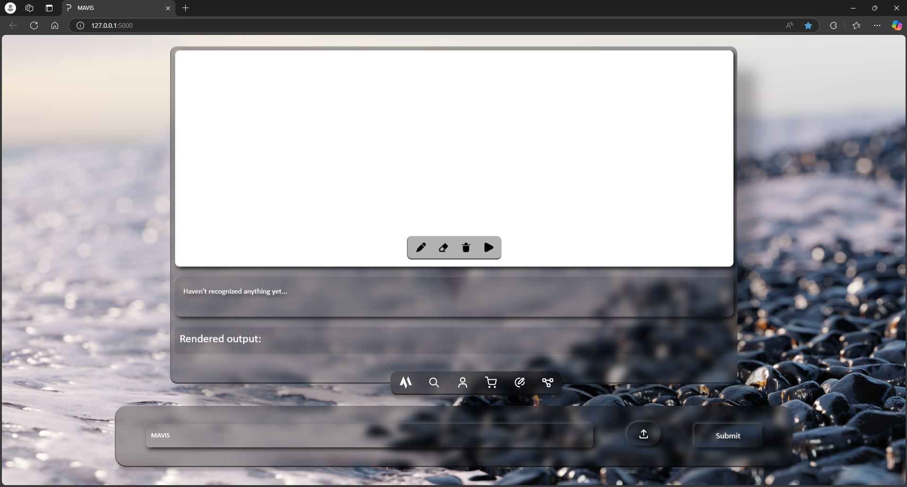
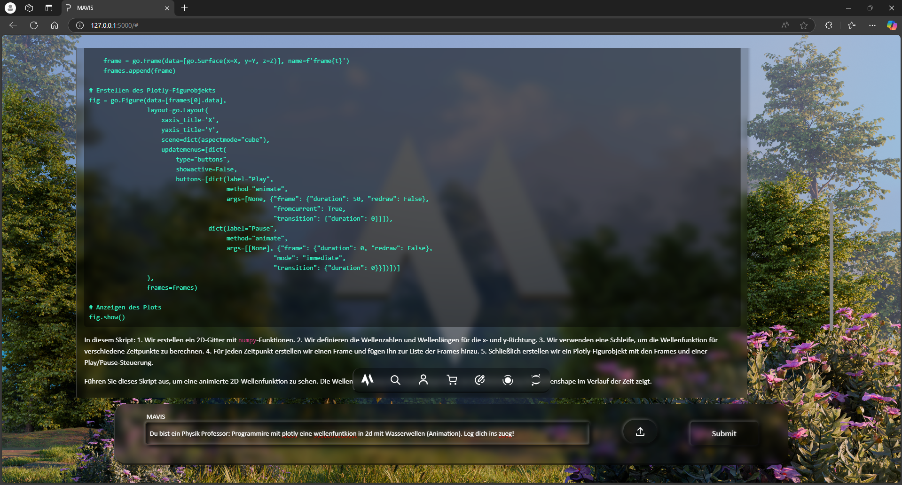
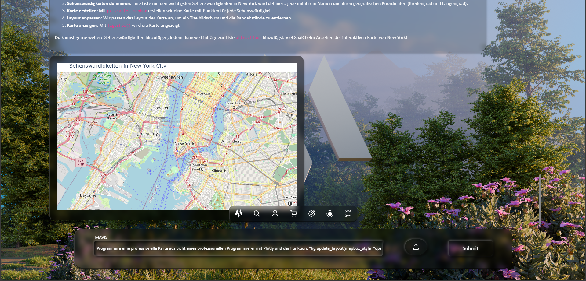
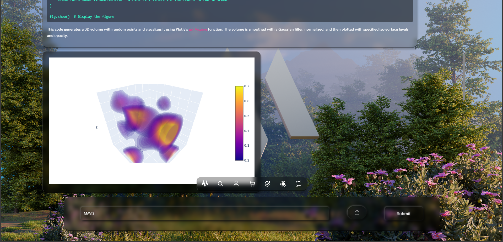
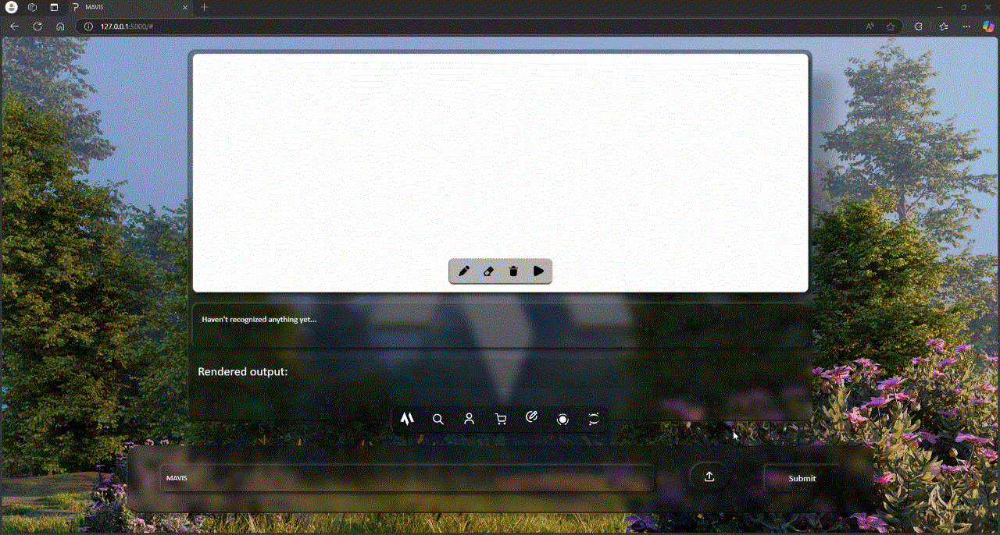
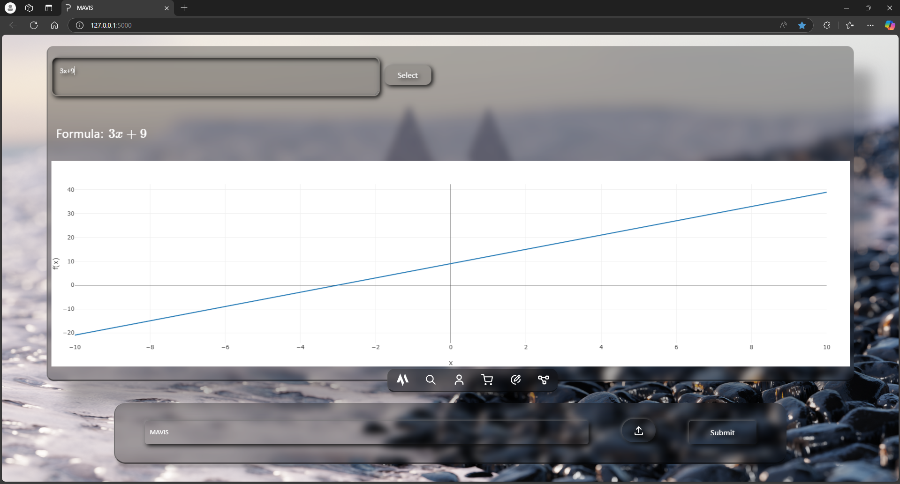

# Benutzung von MAVIS 1.5

## 1. Starten des MAVIS Installers
Nachdem Sie die entsprechende `.bat` oder `.sh`-Datei der gewünschten MAVIS-Version ausgeführt haben, wird ein Terminal auf Ihrem Betriebssystem geöffnet. Dies ist der MAVIS Installer.

Falls Sie MAVIS 1.5 zum ersten Mal starten, kann die Installation je nach Internetgeschwindigkeit zwischen 30 Minuten und 2 Stunden dauern. Wenn MAVIS bereits installiert ist, startet das Programm in etwa einer Minute.

Unabhängig vom Zustand der Installation wird das System stets auf Vollständigkeit geprüft und gegebenenfalls aktualisiert.

## 2. Installation der benötigten Frameworks
Sobald das Terminal geöffnet ist, erscheint eine Liste von Python-Frameworks, die für MAVIS erforderlich sind. Diese Frameworks ermöglichen MAVIS, verschiedene Aufgaben auszuführen. Sie können sie später auch in Jupyter Notebook verwenden, da MAVIS in einer eigenen Python-Umgebung läuft.

Die Ausgabe könnte beispielsweise so aussehen:

```bash
Framework Information:
----------------------
Flask - Lightweight web framework for Python.
Ollama - Tool for integrating with AI APIs.
Jupyter - Open source web application for live code, equations, visualizations and text.
etc.
```

Außerdem wird die folgende Meldung angezeigt, die Sie darauf hinweist, dass Sie gelegentlich PIP aktualisieren sollten:

```bash
Dont forget to update PIP regularly with the command: python -m pip install --upgrade pip.
```

Falls noch nicht geschehen, werden die benötigten Frameworks nun installiert und aktualisiert:

```bash
All frameworks for MAVIS versions 1.2, 1.3, 1.4 and 1.5 are currently being installed and updated:
```

Falls Sie MAVIS zum ersten Mal starten, müssen Sie für jedes Framework bestätigen, dass es installiert werden soll. Geben Sie `y` oder `yes` ein, um die Installation zu starten:

```bash
Would you like to install Flask? [y/n]:
```

Bitte bestätigen Sie dies immer mit `y` oder `yes`, um spätere Probleme zu vermeiden. Dasselbe gilt für zukünftige automatische Aktualisierungen der Frameworks.

## 3. Aktualisierung von MAVIS
Nach der Installation der Frameworks werden Sie gefragt, ob Sie MAVIS aktualisieren möchten. Dabei wird die neueste Version von GitHub heruntergeladen. Die automatische Aktualisierung ist in der Regel stabil, jedoch kann es zu Fehlern kommen. Falls Probleme auftreten, verwenden Sie diesen Befehl manuell:

```bash
git pull https://github.com/Peharge/MAVIS.git
```

Die Abfrage zur Aktualisierung sieht so aus:

```bash
MAVIS Repository Update (experimental):
---------------------------------------
This update function is not yet 100% reliable and errors may occur.
We therefore recommend using the command:
git pull https://github.com/Peharge/MAVIS.git
instead.

MAVIS - Last update: 01/30/2025
Would you like to perform an update? [y/n]:
```

## 4. Installation zusätzlicher KI-Modelle
Nach der Aktualisierung müssen zwei KI-Modelle installiert werden. Diese müssen jeweils mit `y` oder `yes` bestätigt werden.

Anschließend erscheinen einige Systeminformationen, die für die Nutzung von MAVIS nicht zwingend verstanden werden müssen.

## 5. Start von Jupyter Notebook
Nach kurzer Zeit öffnet sich ein weiteres Terminal, in dem Sie gefragt werden, ob Sie Jupyter Notebook öffnen möchten. Jupyter Notebook ist ein Code-Editor, der im Browser läuft und mit MAVIS installiert wird.

```bash
Do you want to start Jupyter Notebook? [y/n]:
```

Falls Sie `y` oder `yes` eingeben, öffnet sich Jupyter Notebook im Browser.

Unabhängig von dieser Auswahl wird MAVIS automatisch in einem Browser-Tab geöffnet. Falls der Browser nicht gestartet wurde, kann es sein, dass ein Verbindungsfehler angezeigt wird. Dies liegt daran, dass der MAVIS-Server etwas mehr Zeit zum Hochfahren benötigt als der Browser. Warten Sie in diesem Fall 15–30 Sekunden und aktualisieren Sie den Tab. Der erste Start kann je nach PC-Leistung etwas länger dauern.

Nach dem erfolgreichen Start sollte Ihr Browser wie folgt aussehen:



## 6. Nutzung von MAVIS
Sie können nun Fragen an den Chatbot senden, Bilder hochladen und das Kontrollpanel verwenden.


Wenn Sie ein Bild hochgeladen haben, erscheint ein kleines Fenster mit dem Bild. Klicken Sie einfach auf das Fenster, um es zu schließen.

Falls Sie den Chatbot bitten möchten, ein Diagramm zu erstellen, weisen Sie ihn an, eines der folgenden Frameworks zu verwenden:
- Matplotlib
- Plotly
- Seaborn
- Altair

MAVIS unterstützt auch LaTeX für mathematische Formeln und kann Berechnungen direkt ausführen.

Hier ein Beispiel für MAVIS im Betrieb:







Standardmäßig ist der Formeleditor geöffnet, mit dem Sie Formeln zeichnen können. Die gezeichneten Formeln werden in die Eingabebox unten als LaTeX-Code umgewandelt und direkt darunter korrekt gerendert angezeigt. Um die Formel zu konvertieren, drücken Sie einfach den schwarzen Play-Button in der Zeichenbox.

Die Eingabebox, in der der LaTeX-Code geschrieben wird, ist mit der unteren Eingabebox in der Taskleiste verbunden und kann als Eingabe für den KI-Chatbot verwendet werden.


Um den Formeleditor zu schließen, drücken Sie den Stift-Button in der Haupt-Taskleiste.



Zusätzlich können Sie den Grafeditor nutzen, um Formeln in einem 2D- oder 3D-Koordinatensystem darzustellen.


Geben Sie Ihre Formel ein und verwenden Sie die "Selekt"-Funktion, um Sonderzeichen, vorgefertigte Formeln, Operationen (Ableitung und Integration) sowie die Darstellung als 2D- oder 3D-Diagramm auszuwählen (standardmäßig 2D). Die Formel wird in Echtzeit angezeigt.



Dieses Fenster können Sie jederzeit schließen, indem Sie erneut auf das entsprechende Icon in der Taskleiste klicken.

<div align="center">
    
</div>

Viel Spaß mit MAVIS! Mit der Zeit werden Sie sich an die Nutzung des Chatbots gewöhnen. Geben Sie dem Chatbot immer eine klare Rolle, z. B.: "Du bist ein professioneller Programmierer, und deine Aufgabe ist es [...] – lege dich ins Zeug!"
